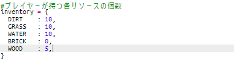

## 新しい木のリソースを作成

新しい木のリソース（WOOD）を作りましょう。 そのために、`variables.py` ファイルにいくつかの変数を追加します。

+ 最初に、新しいリソースに番号を振ります 。 それで、単語 `WOOD` を数字の4の代わりとして使うことができるようになります。
    
    

+ 新しいリソース`WOOD` を`resources`リストに追加します。
    
    

+ リソースには持ち物リストに表示される名前を付ける必要があります。
    
    
    
    1つ上の行の最後にコンマ”`,`”を追加するのを忘れないように。

+ 新しいリソースには画像も必要です。 このプロジェクトはすでに`wood.gif`という画像が含まれています。それを`textures` ディクショナリに追加してください。
    
    

+ `Inventory` のWOOD リソース個数の初期値を設定します。
    
    

+ 最後に、木をワールドに配置するために押す数字キーを追加します。
    
    

+ プロジェクトを実行し、テストします。 木のリソース（WOOD）が持ち物リストに入っていることがわかります。
    
    

+ ワールドには木がありません！ `main.py`ファイルを開き、関数`generateRandomWorld()`を修正します。
    
    
    
    このコードは0から10の乱数を生成し、その番号によりどのリソースを配置するかを決定します。
    
    + 1 か 2 = 水
    + 3 か 4 = 草
    + それ以外 = 土

+ コードを追加し、`randomNumber` が 5だったら木を追加するようにします。
    
    

+ プロジェクトをもう一度テストしてみましょう。 今回はワールドに木があるはずです。
    
    