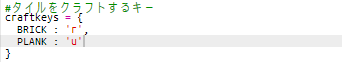

## 木から板をクラフトする

新しく板（PLANK）リソースを木からクラフトしましょう。

+ 最初に、`PLANK`変数を追加します。
    
    

+ `PLANK`変数をresoucesに追加します。
    
    

+ リソースを `'plank'`と名付け、namesに追加します。
    
    

+ `PLANK`リソースに画像を追加します。 このプロジェクトは`plank.gif` 画像を含んでいます。しかし、自分で画像を作成し、アップロードして使用することもできます。
    
    

+ 持ち物リストに板を追加します。
    
    

+ 板を置くキーを設定します。
    
    

+ この板リソースはクラフトできるものなので、クラフトするルールが必要です。３つの木リソースから作るルールとします。 そのルールを`crafting`ディクショナリに追加します。
    
    

+ 最後に、板リソースをクラフトするキーを設定します。
    
    

+ To test your new plank resource, gather up a few wood tiles and then craft some planks from your wood. You can then place your new planks in your world.
    
    