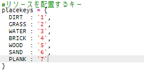
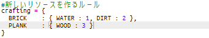

## 木から板をクラフトする

新しいリソース板（PLANK）を木からクラフトしましょう。

+ 最初に、`PLANK`変数を追加。
    
    

+ `PLANK`変数をresoucesに追加。
    
    

+ リソースに `'plank'`と名付け、namesに追加。
    
    

+ `PLANK`リソースに画像を追加。 このプロジェクトは`plank.gif` 画像を含んでいます。しかし、自分の画像を作成してアップロードして使用することもできます。
    
    

+ 持ち物リストに板を追加。
    
    

+ 板を置くキーを設定。
    
    

+ この板リソースはクラフトできるものなので、３つの木リソースからクラフトするルールを作成。 そのルールを`crafting`辞書に追加。
    
    

+ 板リソースをクラフトするキーを追加。 
    
    

+ 板リソースをテストするために、木リソースを集めて板リソースをクラフトする。 ワールドに板リソースが配置できます。
    
    