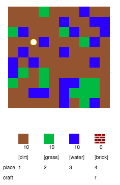
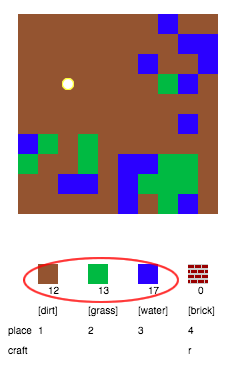
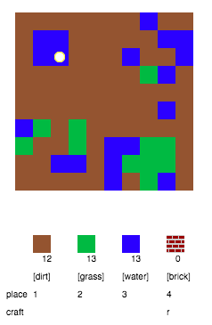
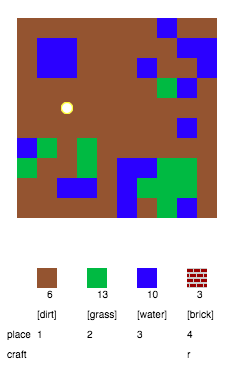

## ಆಟವಾಡುವುದು

+ ಈ trinket: ತೆರೆಯಿರಿ: [rpf.io/codecraft-on](http://rpf.io/codecraft-on){:target="_blank"}.

+ ನಿಮ್ಮ ಆಟಗಾರನನ್ನು ಪ್ರಪಂಚದಾದ್ಯಂತ ಸರಿಸಲು WASD ಕೀಲಿಗಳನ್ನು ಬಳಸಿ, ಅದು ವಿಭಿನ್ನ resources ತುಂಬಿದೆ (ಕೊಳಕು, ಹುಲ್ಲು ಮತ್ತು ನೀರು).
    
    

+ Resources ಸಂಗ್ರಹಿಸಲು ನೀವು ಸ್ಪೇಸ್‌ಬಾರ್ ಒತ್ತಿರಿ. ಪ್ರತಿಯೊಂದು ರೀತಿಯ resource ಅಲ್ಲಿ ಕೆಲವು ಎತ್ತಿಕೊಳ್ಳಿ, ಮತ್ತು ಅವುಗಳನ್ನು ನಿಮ್ಮ ದಾಸ್ತಾನುಗಳಿಗೆ ಸೇರಿಸುವುದನ್ನು ನೀವು ನೋಡುತ್ತೀರಿ.
    
    

+ ನಕ್ಷೆಯಲ್ಲಿ resource ಇರಿಸಲು ಸಂಖ್ಯೆ ಕೀಗಳನ್ನು (1 ರಿಂದ 3) ಒತ್ತಿರಿ. ಉದಾಹರಣೆಗೆ, ನಕ್ಷೆಯಲ್ಲಿ ಸ್ವಲ್ಪ water ಇರಿಸಲು 3 ಒತ್ತಿರಿ. ನಿಮ್ಮ ದಾಸ್ತಾನುಗಳಲ್ಲಿ ಸ್ವಲ್ಪ ನೀರು ಇದ್ದರೆ ಮಾತ್ರ ಇದು ಕೆಲಸ ಮಾಡುತ್ತದೆ.
    
    

+ ಮೆನುವಿನಲ್ಲಿ ಪ್ರದರ್ಶಿಸಲಾದ key ಒತ್ತುವ ಮೂಲಕ ನೀವು ಐಟಂ ಅನ್ನು ರಚಿಸಬಹುದು. Crafting ಎಂದರೆ ನಿಮ್ಮ inventory ಅಲ್ಲಿ ನೀವು ಈಗಾಗಲೇ ಹೊಂದಿರುವ ವಸ್ತುಗಳನ್ನು ಹೊಸದನ್ನು ರಚಿಸಲು ಸಂಯೋಜಿಸುವುದು. ಹೊಸ brick ತಯಾರಿಸಲು 'r' key ಒತ್ತಲು ಪ್ರಯತ್ನಿಸಿ (ನಿಮ್ಮ inventory 2 dirt ಮತ್ತು 1 water ಇರುವವರೆಗೆ).
    
    

+ ನಿಮ್ಮ ಹೆಣೆದ brick ಇರಿಸಲು ನೀವು '4' key ಒತ್ತಿ.
    
    