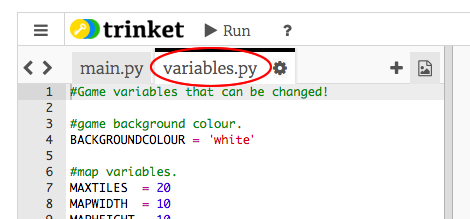
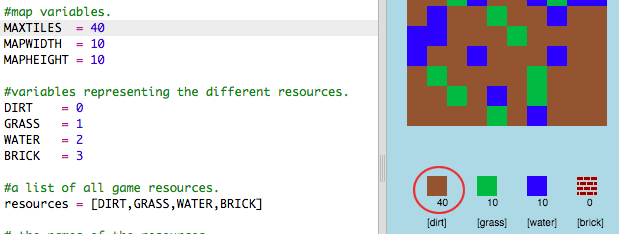

## ನಿಮ್ಮ ಆಟವನ್ನು ಕಸ್ಟಮೈಸ್ ಮಾಡಲಾಗುತ್ತಿದೆ

ನಿಮ್ಮ ಆಟ ಹೇಗೆ ಕಾರ್ಯನಿರ್ವಹಿಸುತ್ತದೆ ಎಂಬುದನ್ನು ಬದಲಾಯಿಸಲು ಕೆಲವು ವೇರಿಯಬಲ್ಗಳನ್ನು ಮಾರ್ಪಡಿಸೋಣ.

+ ` variables.py` ಫೈಲ್ ಮೇಲೆ ಕ್ಲಿಕ್ ಮಾಡಿ ಬದಲಾಯಿಸಬಹುದಾದ ಕೆಲವು variable ನೋಡಲು.
    
    

+ ನಿಮ್ಮ ` BACKGROUNDCOLOUR` ನ ಮೌಲ್ಯವನ್ನು ಬದಲಾಯಿಸಿ ವೇರಿಯಬಲ್, ಮತ್ತು ನಿಮ್ಮ ಆಟದ ಬದಲಾವಣೆಯನ್ನು ನೋಡಲು 'Run' ಕ್ಲಿಕ್ ಮಾಡಿ.
    
    

+ Variable ` MAXTILES ` ನಿಮ್ಮ resource ಇರಿಸಬಹುದಾದ ಪ್ರತಿಯೊಂದು redource ಮೊತ್ತವಾಗಿದೆ. ಪ್ರತಿ resourceಕ್ಕಿಂತ 20 ಕ್ಕಿಂತ ಹೆಚ್ಚು (ಅಥವಾ ಕಡಿಮೆ) ಸಂಗ್ರಹಿಸಲು ನೀವು ಬಯಸಿದರೆ ಈ ವೇರಿಯೇಬಲ್ ಅನ್ನು ಬದಲಾಯಿಸಿ.
    
    