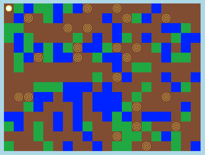

## ಹೊಸ wood resource ರಚಿಸುವುದು

ಹೊಸ wood resource ರಚಿಸೋಣ. ಇದನ್ನು ಮಾಡಲು ಕೆಲವು Variable `variables.py` ಫೈಲ್ ಇದಕ್ಕೆ ಸೇರಿಸಬೇಕು.

+ ಮೊದಲಿಗೆ, ನಿಮ್ಮ ಹೊಸ resource ನೀವು ಸಂಖ್ಯೆಯನ್ನು ನೀಡಬೇಕಾಗಿದೆ. ನಂತರ ನೀವು ನಿಮ್ಮ ಕೋಡ್ ಅಲ್ಲಿ ಸಂಖ್ಯೆಯ 4 ಬದಲು `WOOD` ಬಳಸಬಹುದು.
    
    

+ ನೀವು ನಿಮ್ಮ ಹೊಸ `WOOD`resource `resources` list ಜೊತೆ ಸೇರಿಸಬೇಕು.
    
    

+ ನಿಮ್ಮ resourceಗೆ ನೀವು ಹೆಸರನ್ನು ಸಹ ನೀಡಬೇಕು, ಅದನ್ನು inventoryಅಲ್ಲಿ ಪ್ರದರ್ಶಿಸಲಾಗುವುದು.
    
    
    
    ಅಲ್ಪವಿರಾಮವನ್ನು ಗಮನಿಸಿ `, ` ಮೇಲಿನ ಸಾಲಿನ ಕೊನೆಯಲ್ಲಿ.

+ ನಿಮ್ಮ ಸಂಪನ್ಮೂಲಕ್ಕೆ ಚಿತ್ರದ ಅಗತ್ಯವಿದೆ. ಈ ಯೋಜನೆ ಈಗಾಗಲೇ ` wood.gif ` ಎಂಬ image ಒಳಗೊಂಡಿದೆ `textures` dictionary ಸೇರಿಸಬೇಕು.
    
    

+ ನಿಮ್ಮ resource ಜೊತ ಸಂಖ್ಯೆ ಸೇರಿಸಿ ಅದು ಶುರು ಮಾಡುವ ಮೊದಲು ನಿಮ್ಮ `inventory` ಇರಬೇಕು.
    
    

+ ಅಂತಿಮವಾಗಿ, ಜಗತ್ತಿನಲ್ಲಿ ಮರವನ್ನು ಇರಿಸಲು ನೀವು ಒತ್ತುವ key ಸೇರಿಸಿ.
    
    

+ ಅದನ್ನು ಪರೀಕ್ಷಿಸಲು ಮಾಡಲು ನಿಮ್ಮ ಯೋಜನೆಯನ್ನು ರನ್ ಮಾಡಿ. ನಿಮ್ಮ inventoryಅಲ್ಲಿ ನೀವು ಹೊಸ 'wood'resource ಹೊಂದಿರುವಿರಿ ಎಂದು ನೀವು ನೋಡುತ್ತೀರಿ.
    
    

+ ನಿಮ್ಮ ಜಗತ್ತಿನಲ್ಲಿ wood ಇಲ್ಲ! ಇದನ್ನು ಸರಿಪಡಿಸಲು, ನಿಮ್ಮ ` main.py ` ಫೈಲ್ ಕ್ಲಿಕ್ ಮಾಡಿ ಮತ್ತು `generateRandomWorld () ` ಎಂಬ ಕಾರ್ಯವನ್ನು ಹುಡುಕಿ.
    
    
    
    ಈ ಕೋಡ್0 ಮತ್ತು 10 ರ ನಡುವೆ ಯಾದೃಚ್ ಸಂಖ್ಯೆಯನ್ನು ಉತ್ಪಾದಿಸುತ್ತದೆ ಮತ್ತು ಯಾವ resource ಇಡಬೇಕೆಂದು ನಿರ್ಧರಿಸಲು ಸಂಖ್ಯೆಯನ್ನು ಬಳಸುತ್ತದೆ:
    
    + 1 or 2 = water
    + 3 or 4 = grass
    + anything else = DIRT

+ `randomNumber` 5 ಇದ್ದಾಗಲೆಲ್ಲಾ ನಿಮ್ಮ ಜಗತ್ತಿಗೆ wood ಸೇರಿಸಲು ಈ ಕೋಡ್ ಸೇರಿಸಿ.
    
    

+ Test your project again. This time, you should see some wood appear in your world.
    
    