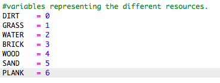
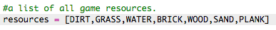
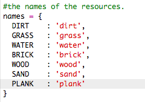
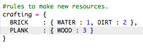
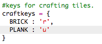

## Woodಇಂದ planks ತಯಾರಿಸುವುದು

Woodಇಂದ ರಚಿಸಲಾದ ಹೊಸ plank resource ರಚಿಸೋಣ.

+ ಮೊದಲು, ಹೊಸ `PLANK` ನಿಮ್ಮ ಆಟಕ್ಕೆ ವೇರಿಯಬಲ್.
    
    

+ ಮೊದಲು ಒಂದು ಹೊಸ `PLANK` variable ನಿಮ್ಮ ಆಟಕ್ಕೆ ಸೇರಿಸಿ.
    
    

+ Resource `'plank'` ಹೆಸರಿಸಿ.
    
    

+ ನಿಮ್ಮ `PLANK` resourceಗೆ ಒಂದು image ನೀಡಿ. ಯೋಜನೆ ಮೊದಲೇ ಒಂದು `plank.gif` image ಹೊಂದಿದೆ ನೀವು ಅದನ್ನು ಬಳಸಬಹುದು ಅಥವ, ಬೇಕಿದ್ದರೆ ನಿನ್ನ ಸ್ವಂತ image ರಚಿಸಬಹುದು.
    
    

+ ನಿಮ್ಮ inventory (ಇನ್ವೆಂಟರಿ) ಗೆ planks ಸೇರಿಸಿ.
    
    

+ Planks(ಪ್ಲಾಂಕ್ಸ್) ಇರಿಸಲು key ಹೊಂದಿಸಿ.
    
    

+ ಈ resource ರಚಿಸಬಹುದಾದಂತೆ, ನೀವು craft ನಿಯಮವನ್ನು ರಚಿಸಬೇಕಾಗಿದೆ, ಅಂದರೆ 3 wood ಅಂಚುಗಳಿಂದ planks ತಯಾರಿಸಬಹುದು. ಈ ಕೋಡ್ `crafting` ಡಿಕ್ಟನರಿ ಜೊತೆ ಸೇರಿಸಿ.
    
    

+ ಕೊನೆಯದಾಗಿ, ಹೊಸ planks ತಯಾರಿಸಲು ನೀವು key ಹೊಂದಿಸಬೇಕಾಗಿದೆ.
    
    

+ ನಿಮ್ಮ ಹೊಸ plank resource ಪರೀಕ್ಷಿಸಲು ಕೆಲವು wood tiles ಸಂಗ್ರಹಿಸಿ ನಂತರ ನಿಮ್ಮ woodಇಂದ planks ರಚಿಸಿ. ನಂತರ ನೀವು ನಿಮ್ಮ ಹೊಸ planks ನಿಮ್ಮ ಜಗತ್ತಿನಲ್ಲಿ ಇರಿಸಬಹುದು.
    
    