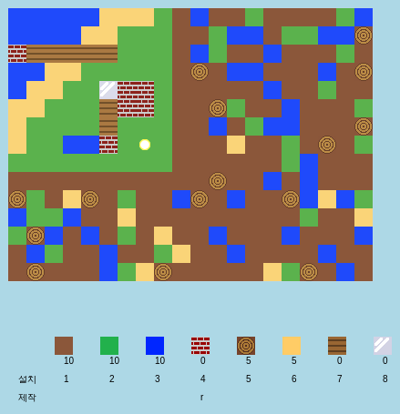

## 소개

이 프로젝트에서 여러분은 2차원 버전의 마인크래프트를 개선하기 위해 설계하고 코딩할 것입니다.

  <iframe src="https://trinket.io/embed/python/3db67c252b?outputOnly=true&start=result" width="600" height="500" frameborder="0" marginwidth="0" marginheight="0" allowfullscreen>
  </iframe>
  

### 교육자들을 위한 추가 정보

이 프로젝트를 인쇄하려면 [인쇄용 문서](https://projects.raspberrypi.org/ko-KR/projects/codecraft/print)를 사용하세요.

--- collapse ---

## 제목: 교육자 노트

## 소개

이 프로젝트에서 아이들은 기본 2D 마인크래프트의 복제판을 만들어가며 그래픽과 게임 설계를 배웁니다. 아이들은 새로운 자원을 만들고, 새로운 자원을 만들기 위해 조합하는 규칙도 만들게 됩니다. 이는 파이썬의 변수, 리스트, 딕셔너리 개념을 이해하고 조작함으로써 달성될 것 입니다.

## 온라인 자료

**이 프로젝트는 파이썬3를 사용합니다.** 파이썬 코드를 온라인에서 작성하기 위해 [Trinket](https://trinket.io/)을 사용하는것을 추천합니다. 이 프로젝트에 포함된 Trinket은 다음과 같습니다:

+ ['코드크래프트' 출발자 프로젝트 -- trinket.io/python/6e303da9a6](https://trinket.io/python/6e303da9a6)

완성된 프로젝트가 저장된 Trinket도 있습니다:

+ ['코드크래프트' 완성본 -- trinket.io/python/3db67c252b](https://trinket.io/python/3db67c252b)

## 오프라인 자료

여러분의 선호에 따라 프로젝트를 [오프라인에서 완성](https://www.codeclubprojects.org/en-GB/resources/python-working-offline/)할 수 있습니다. 'Project Materials' 라는 링크를 클릭하여 이 프로젝트의 자료를 확인해볼 수 있습니다. 이 링크에는 어린이들이 프로젝트를 오프라인으로 완료하는 데 필요한 자료가 포함된 'Project Resources' 섹션이 있습니다. 어린이들이 이러한 자료의 사본에 접근할 수 있는지 확인하십시오. 이 섹션에는 아래와 같은 파일들이 포함되어 있습니다.

+ codecraft/codecraft.py
+ codecraft/variables.py
+ codecraft/brick.gif
+ codecraft/dirt.gif
+ codecraft/glass.gif
+ codecraft/grass.gif
+ codecraft/plank.gif
+ codecraft/player.gif
+ codecraft/sand.gif
+ codecraft/water.gif
+ codecraft/wood.gif

이 프로젝트의 완성된 버전은 'Volunteer Resources' 섹션에서 찾을 수 있습니다.

+ codecraft-finished/codecraft.py
+ codecraft-finished/variables.py
+ codecraft-finished/brick.gif
+ codecraft-finished/dirt.gif
+ codecraft-finished/glass.gif
+ codecraft-finished/grass.gif
+ codecraft-finished/plank.gif
+ codecraft-finished/player.gif
+ codecraft-finished/sand.gif
+ codecraft-finished/water.gif
+ codecraft-finished/wood.gif

(모든 자료는 `.zip`파일 형식으로 다운로드 할 수 있습니다.)

## 학습 목표

+ 그래픽 생성 및 편집;
+ 게임 디자인;
+ 코드 편집: 
    + 변수;
    + 리스트;
    + 딕셔너리.

이 프로젝트는 [라즈베리파이 디지털 메이킹 커리큘럼](http://rpf.io/curriculum) 중 아래의 과정에 있는 요소들을 다룹니다.

+ [기초적인 2차원과 3차원의 물체의 설계.](https://www.raspberrypi.org/curriculum/design/creator)

+ [문제를 해결하기 위한 프로그래밍 구조의 조합.](https://www.raspberrypi.org/curriculum/programming/builder)

## 도전과제

+ "자신만의 세계 만들기" - 게임을 플레이하며 블록을 배치하고 제작합니다.
+ "세계 크기 변경" - `MAPWIDTH`와 `MAPHEIGHT`을 수정하여 월드 사이즈 조정
+ "모래 만들기" - 게임 데이터를 활용하여 새로운 모래 자원을 생성
+ "모래로 유리 만들기" - 제작 가능한 새로운 유리 자원 만들기
+ "더 많은 자원 생성하기" - 배운 것을 사용하여 더 많은 블럭을 만들고 규칙을 제작

## 자주 물어보는 질문

+ 아이들은 딕셔너리/리스트의 요소가 쉼표로 구분된다는 것을 상기시켜야 할 수 도 있습니다. 예를 들어, 인벤토리에 아이템을 추가하거나, 그래픽, 제작 규칙을 추가하는 것이 해당될 수 있습니다.

--- /collapse ---

--- collapse ---
---
title: Project materials
---

## 프로젝트 리소스

+ [프로젝트의 모든 자료가 들어있는 .zip 파일](resources/codecraft-resources.zip)
+ [코드크래프트 프로젝트 자료가 포함된 온라인 Trinket](https://trinket.io/python/6e303da9a6)

## 교육자를 위한 자료

+ [완료된 프로젝트 리소스가 담긴 .zip 파일](solutions/codecraft-solution.zip)
+ [완성된 온라인 Trinket 프로젝트](https://trinket.io/python/3db67c252b)

--- /collapse ---