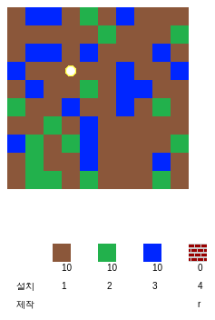
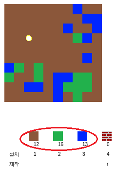
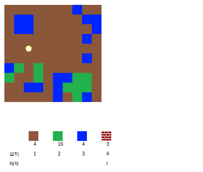
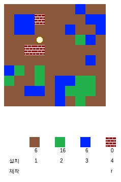

## 게임 플레이 하기

+ 템플릿 Trinket을 열어주세요: [trinket.io/python/6e303da9a6](https://trinket.io/python/6e303da9a6){:target="_blank"}.

+ WASD 키를 사용하여 플레이어를 월드에서 움직이게 할 수 있습니다.
    
    

+ 스페이스 바를 눌러 자원을 수집할 수 있습니다. 각각의 자원을 월드에서 채집하면 인벤토리에 추가된 것을 볼 수 있습니다.
    
    

+ 숫자 키 (1~3)을 눌러 월드에 자원을 배치할 수 있습니다. 예를 들어 월드에 물을 배치하고자 한다면 3을 누르면 됩니다. 단, 인벤토리 내 물이 있는 경우에만 작동합니다.
    
    

+ 메뉴에 표시된 키를 눌러 아이템을 만들 수 있습니다. 제작은 인벤토리 내 있는 아이템을 결합하여 새로운 아이템을 만드는 것을 의미합니다. 'r' 키를 눌러 새로운 벽돌을 만들 수 있습니다. (2개의 흙과 1개의 물이 인벤토리 내 필요합니다.)
    
    

+ 그런 다음 '4'키를 눌러서 만들어진 벽돌을 배치 할 수 있습니다.
    
    