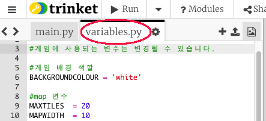
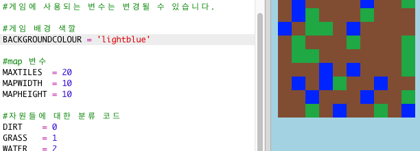
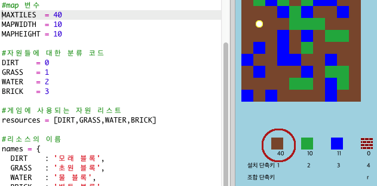

## Customising your game

Let’s modify some variables to change how your game works.

+ Click the `variables.py` file to see some variables that can be changed.
    
    

+ Change the value of your `BACKGROUNDCOLOUR` variable, and click 'Run' to see the change to your game.
    
    

+ The variable `MAXTILES` is the amount of each resource that can be held in your inventory. 만약 인벤토리에 20개 이상(혹은 이하) 담기도록 하고 싶으면 이 변수를 수정하세요.
    
    