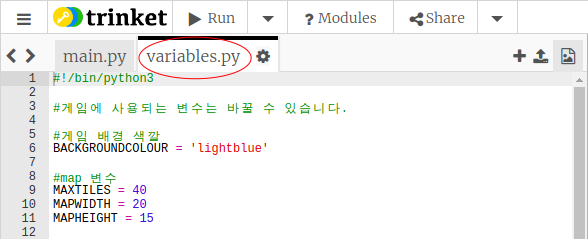
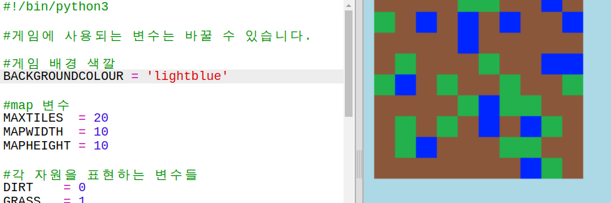
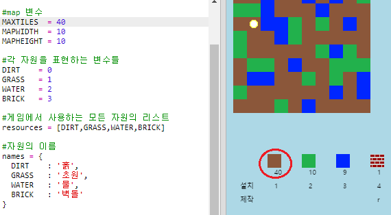

## 게임 맞춤 설정

여러 변수를 수정하면 게임이 어떻게 바뀌는지 알아 봅시다.

+ `variables.py`을 클릭하여 변경할 수 있는 변수를 확인하세요.
    
    

+ `BACKGROUNDCOLOUR` 변수 값을 아래와 같이 변경하고, 실행을 눌러 실행 결과를 확인해 보세요.
    
    

+ `MAXTILES`은 최대 각각 몇 개의 아이템을 인벤토리에 저장할 수 있는지를 담고 있는 변수입니다. 만약 인벤토리에 20개 이상(혹은 이하) 담기도록 하고 싶으면 이 변수를 수정하세요.
    
    