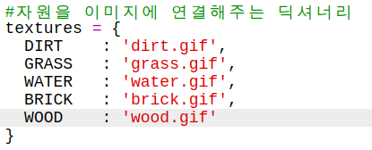
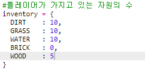
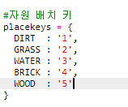
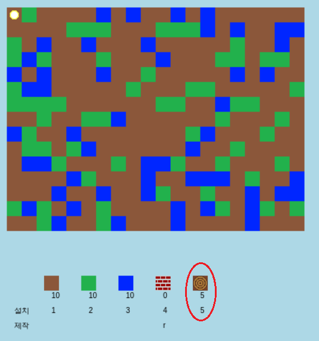
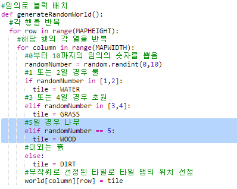

## 나무 자원 만들기

나무 아이템을 새롭게 만들어 봅시다. 나무를 추가하기 위해서는, `variables.py` 에 일부 변수를 추가해야 합니다.

+ 먼저, 새로운 나무 자원에 번호를 부여해야 합니다. 그렇게 하면 코드 중에서 `WOOD`라는 단어 대신 4라는 번호를 사용할 수 있습니다.
    
    

+ 새로운 `WOOD` 자원을 `resources` 리스트에 추가합니다.
    
    

+ 또한 인벤토리에 표시되는 아이템 명은 아래처럼 추가할 수 있습니다.
    
    
    
    각 라인의 끝에는 마지막 요소를 제외하고 `,`가 추가되어야 합니다.

+ 리소스에는 이미지도 필요합니다. 이 프로젝트에는 이미 `wood.gif`가 포함되어 있습니다. 이를 `textures` 딕셔너리에 추가해 봅시다.
    
    

+ Add the number of your resource that should be in your `inventory` to start with.
    
    

+ Finally, add the key that you'll press to place wood in the world.
    
    

+ Run your project to test it. You'll see that you now have a new 'wood' resource in your inventory.
    
    

+ There's no wood in your world! To fix this, click on your `main.py` file and find the function called `generateRandomWorld()`.
    
    
    
    This code generates a random number between 0 and 10, and uses the number to decide which resource to place:
    
    + 1 or 2 = water
    + 3 or 4 = grass
    + anything else = DIRT

+ Add this code to add wood to your world whenever the `randomNumber` is 5.
    
    

+ 프로젝트를 다시 테스트해 보세요. 이제 월드에서 아래와 같이 나무가 보일 것입니다.
    
    