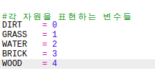
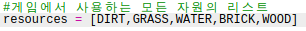
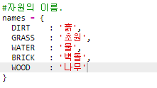

## 새로운 나무 자원 만들기

나무 아이템을 새롭게 만들어 봅시다. 나무를 추가하기 위해서는, `variables.py` 에 일부 변수를 추가해야 합니다.

+ 먼저, 새로운 나무 자원에 번호를 부여해야 합니다. 그렇게 하면 코드 중에서 `WOOD`라는 단어 대신 4라는 번호를 사용할 수 있습니다.
    
    

+ 새로운 `WOOD` 자원을 `resources` 리스트에 추가합니다.
    
    

+ 또한 인벤토리에 표시되는 아이템 명은 아래처럼 추가할 수 있습니다.
    
    
    
    각 라인의 끝에는 마지막 요소를 제외하고 `,`가 추가되어야 합니다.

+ 리소스에는 이미지도 필요합니다. 이 프로젝트에는 이미 `wood.gif`가 포함되어 있습니다. 이를 `textures` 딕셔너리에 추가해 봅시다.
    
    

+ 시작될 때 `인벤토리`에 있어야 하는 자원 개수를 추가합니다.
    
    

+ 마지막으로, 월드에 나무를 배치하기 위해 누르는 키를 추가하세요.
    
    

+ 테스트를 위해 프로젝트를 실행해 보세요. 새로운 '나무' 자원이 아래와 같이 추가된 것을 볼 수 있습니다.
    
    

+ 그런데 월드에는 나무가 없습니다! 이 문제를 해결하기 위해서는 `main.py` 파일의 `generateRandomWorld()` 함수를 찾아 보세요. 
    
    
    
    이 코드는 0부터 10까지의 랜덤 숫자를 생성하는데, 이 숫자를 기반으로 어떤 블럭이 세계에 배치되는지 정하게 됩니다.
    
    + 1이나 2 = 물 블록
    + 3이나 4 = 초원 블록
    + 이외 = 흙 블록

+ 아래와 같이 `randomNumber`가 5인 경우엔 나무가 월드 안에 추가되도록 이 코드를 추가 하세요.
    
    

+ 프로젝트를 다시 테스트해 보세요. 이제 월드에서 아래와 같이 나무가 보일 것입니다.
    
    