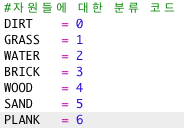
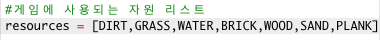
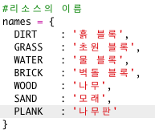
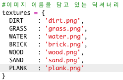
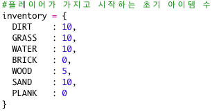
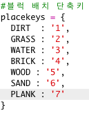
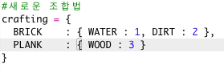
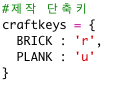

## 나무로 나무판 만들기

이번에는 나무를 가공해서 새로운 나무 판을 만들어 봅시다.

+ 먼저, `PLANK` 변수를 게임에 추가해 주세요.
    
    

+ 새로운 `PLANK` 변수를 아래와 같이 추가합니다.
    
    

+ 자원의 이름은 `'plank'`으로 지정하세요.
    
    

+ `PLANK` 자원에 이미지를 부여합니다. 이 프로젝트는 이미 `plank.gif` 이미지가 포함되어 있으나, 원하는 경우 이미지를 만들고 업로드할 수 있습니다.
    
    

+ 인벤토리에 나무판을 아래와 같이 추가하세요.
    
    

+ 나무판을 배치하는 키를 설정하세요.
    
    

+ 이 자원은 가공 할 수 있으므로 세개의 나무 타일로 나무판을 만드는 가공 규칙을 추가 해야 합니다. 이 코드를 `crafting` 딕셔너리에 추가하세요.
    
    

+ 마지막으로, 나무판을 제작하는 키를 설정하세요.
    
    

+ 나무판을 테스트하기 위해서는 몇 개의 나무를 모은 다음 나무판을 만들면 됩니다. 이제 새로운 나무판을 월드에 배치 할 수 있습니다.
    
    