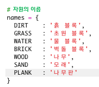

## 나무를 가공해서 나무판 만들기

이번에는 나무를 가공해서 새로운 나무 판을 만들어 봅시다.

+ 먼저, `PLANK` 변수를 게임에 추가해 주세요.
    
    

+ 새로운 `PLANK` 변수를 아래와 같이 추가합니다.
    
    

+ Name the resource `'plank'`.
    
    

+ `PLANK` 자원에 이미지를 부여합니다. 이 프로젝트는 이미 `plank.gif` 이미지가 포함되어 있으나, 원하는 경우 이미지를 만들고 업로드할 수 있습니다.
    
    

+ Add planks to your inventory.
    
    

+ Set a key for placing planks.
    
    

+ As this resource can be crafted, you need to create a crafting rule, which is that a plank can be made from 3 wood tiles. Add this code to the `crafting` dictionary.
    
    

+ Finally, you need to set a key for crafting new planks.
    
    

+ To test your new plank resource, gather up a few wood tiles and then craft some planks from your wood. You can then place your new planks in your world.
    
    