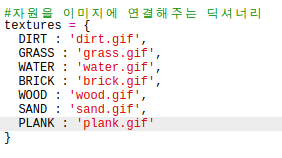
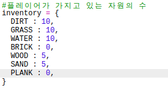

## 나무에서 나무 판 만들기

이번에는 나무로 만든 새로운 나무 판을 만들어 보겠습니다.

+ 먼저, `PLANK` 변수를 코드에 추가해 주세요.
    
    

+ 새로운 `PLANK` 변수를 아래와 같이 추가합니다.
    
    

+ 리소스의 이름은 `'나무판'`으로 지정하세요.
    
    

+ `PLANK` 리소스에 이미지를 부여합니다. The project already contains a `plank.gif` image, but you can create your own if you prefer.
    
    

+ 인벤토리에 나무판을 아래와 같이 추가하세요.
    
    

+ 나무판을 추가하는 키를 설정하세요.
    
    

+ 인벤토리에 기본 배정되는 나무판 개수가 0개이므로, 나무판에 대한 조합법을 만들어야 합니다. 아래 코드를 `crafting` 딕셔너리에 추가하세요.
    
    

+ 마지막으로, 나무판을 제작하는 키를 설정하세요.
    
    

+ 나무판을 테스트하기 위해서는 몇 개의 나무를 모은 다음 나무판을 만들면 됩니다. 그리고 세계에 새로운 나무판을 추가해 보세요.
    
    