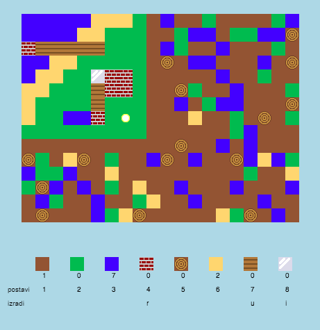

## Uvod

U ovom projektu dizajniraćeš i kodirati poboljšanja za 2D verziju Minecrafta.

  <iframe src="https://trinket.io/embed/python/ebc5b0148b?outputOnly=true&start=result" width="600" height="500" frameborder="0" marginwidth="0" marginheight="0" allowfullscreen>
  </iframe>
  

### Dodatne informacije za vođe kluba

Ukoliko je potrebno da odštampate ovaj projekat, koristite [Verziju za štampu](https://projects.raspberrypi.org/en/projects/codecraft/print).

## \--- collapse \---

## title: Bilješke za vođe kluba

## Uvod:

U ovom projektu djeca će učiti o aspektima grafike i dizajna igara tako što će poboljšati kopiju 2D igre Minecraft. Djeca će kreirati nove resurse i osmisliti pravila za kombinovanje resursa radi izrade novih resursa. To će postići razumijevanjem i manipulacijom promjenljivih, listi i rječnika.

## Online izvori

**U ovom projektu koristi se Python 3.** Preporučujemo korišćenje [trinketa](https://trinket.io/) za online pisanje u Pythonu. Ovaj projekat sadrži sljedeće Trinkete:

+ ['CodeCraft' starter project -- rpf.io/codecraft-on](http://rpf.io/codecraft-on)

Takođe postoji trinket koji sadrži završen projekat:

+ [‘CodeCraft’ Finished -- trinket.io/python/ebc5b0148b](https://trinket.io/python/ebc5b0148b)

## Offline izvori

Ako želite, ovaj projekat može biti [izrađen offline](https://www.codeclubprojects.org/en-GB/resources/python-working-offline/). Izvorima projekta možete pristupiti klikom na link projekta 'Projektni materijali'. Navedeni link sadrži odjeljak 'Izvori projekta' u kojem se nalaze izvori koji će djeci biti potrebni kako bi izradila ovaj projekat offline. Obezbijedite da svako dijete ima pristup kopiji ovih izvora. Odjeljak sadrži sljedeće datoteke:

+ codecraft/codecraft.py
+ codecraft/variables.py
+ codecraft/brick.gif
+ codecraft/dirt.gif
+ codecraft/glass.gif
+ codecraft/grass.gif
+ codecraft/plank.gif
+ codecraft/player.gif
+ codecraft/sand.gif
+ codecraft/water.gif
+ codecraft/wood.gif

Takođe, završenu verziju ovoga projekta možete naći u odjeljku 'Izvori za volontere' koji sadrži:

+ codecraft-finished/codecraft.py
+ codecraft-finished/variables.py
+ codecraft-finished/brick.gif
+ codecraft-finished/dirt.gif
+ codecraft-finished/glass.gif
+ codecraft-finished/grass.gif
+ codecraft-finished/plank.gif
+ codecraft-finished/player.gif
+ codecraft-finished/sand.gif
+ codecraft-finished/water.gif
+ codecraft-finished/wood.gif

(All of the resources above are also downloadable as `.zip` files.)

## Ciljevi učenja

+ Kreiranje i uređivanje grafike;
+ Dizajn igre;
+ Uređivanje: 
    + Promjenljivih;
    + Listi;
    + Rječnika.

Ovim projektom obuhvaćeni su elementi iz sljedećih dijelova [Raspberry Pi Digital Making Curriculum](http://rpf.io/curriculum):

+ [Dizajniranje osnovnih 2D i 3D elemenata.](https://www.raspberrypi.org/curriculum/design/creator)

+ [Kombinujte programske konstrukcije za rješavanje problema.](https://www.raspberrypi.org/curriculum/programming/builder)

## Izazovi

+ ''Izgradi svoj svijet'' - Igranje igre, postavljanje i izrada postojećih blokova.
+ ''Promijeni veličinu svog svijeta'' - Uređivanje promjenljivih `SIRINAMAPE` i `VISINAMAPE` radi izmjene veličine svijeta.
+ ''Kreiraj pijesak'' - Kreiranje novog resursa, pijeska, zajedno sa ostalim potrebnim podacima.
+ ''Izradi staklo od pijeska'' - Kreiranje stakla, novog resursa koji se može izraditi od već postojećeg resursa.
+ ''Kreiraj još resursa'' - Primjena naučenog za kreiranje još blokova i pravila za izradu resursa.

## Često postavljana pitanja

+ Children may need reminding that elements of a dictionary/list are separated by a comma. For example, when adding inventory items, graphics and crafting rules to the game.

\--- /collapse \---

## \--- collapse \---

## title: Projektni materijali

## Izvori projekta

+ [.zip datoteka koja sadrži sve izvore projekta](resources/codecraft-resources.zip)
+ [Online Trinket koji sadrži sve izvore projekta 'CodeCraft'](http://rpf.io/codecraft-on)

## Izvori za vođe kluba

+ [.zip datoteka koja sadrži sve završene izvore projekta](solutions/codecraft-solution.zip)
+ [Završen Trinket projekat online](https://trinket.io/python/ebc5b0148b)

\--- /collapse \---