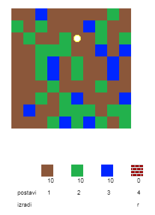
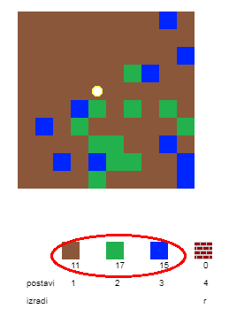
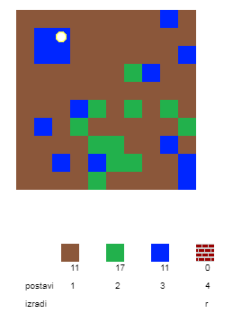
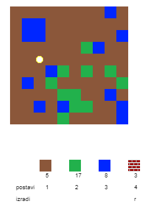
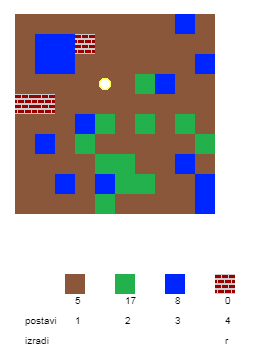

## Igranje igre

+ Otvori ovaj trinket: [rpf.io/codecraft-on](http://rpf.io/codecraft-on){:target="_blank"}.

+ Koristi tastere W, A, S i D za pomjeranje igrača po svijetu koji je pun različitih resursa (zemlje, trave i vode).
    
    

+ Možeš da pritisneš taster za razmak za sakupljanje resursa. Pokupi nekoliko komada od svake vrste resursa i vidjećeš da su dodati u tvoj inventar.
    
    

+ Pritisni brojeve od 1 do 3 da postaviš resurse na mapu. Na primjer, pritisni 3 da postaviš vodu na mapu. Ovo će funkcionisati samo ako imaš vodu u svom inventaru.
    
    

+ Možeš da izradiš elemenat tako što ćeš pritisnuti taster prikazan u meniju. Izrađivanje znači spajanje elemenata koje već imaš u svom inventaru kako bi napravio/napravila nove. Probaj da pritisneš taster 'r' kako bi izradio/izradila novu ciglu (to je moguće samo ako imaš dvije zemlje i jednu vodu u svom inventaru).
    
    

+ Zatim pritisni taster '4' da postaviš cigle koje si izradio/izradila.
    
    