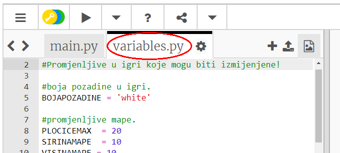
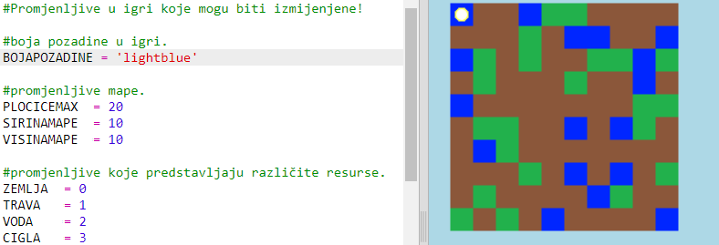
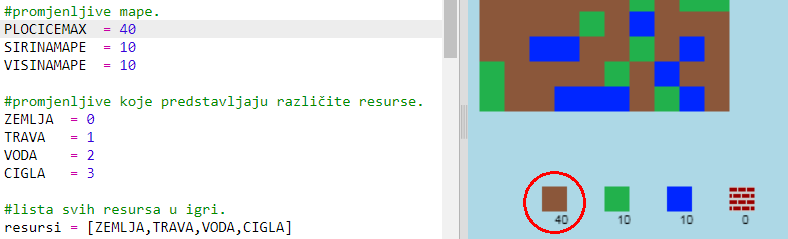

## Prilagođavanje igre

Izmijenimo neke promjenljive kako bismo promijenili način na koji igra funkcioniše.

+ Klikni na datoteku `variables.py` da pogledaš neke promjenljive koje mogu biti izmijenjene.
    
    

+ Promijeni vrijednost svoje promjenljive `BOJAPOZADINE`, a zatim klikni na 'Run' da vidiš izmjenu u svojoj igri.
    
    

+ Promjenljiva `PLOCICEMAX` je količina svakog resursa koja se može nalaziti u tvom inventaru. Izmijeni ovu promjenljivu ako u svom inventaru želiš da imaš više (ili manje) od 20 komada svakog resursa.
    
    