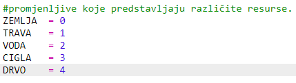
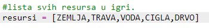
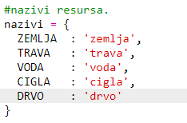
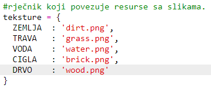
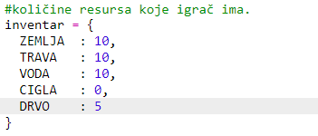
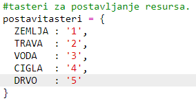
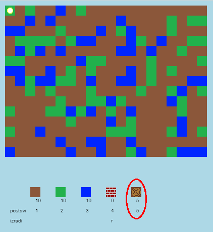
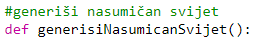
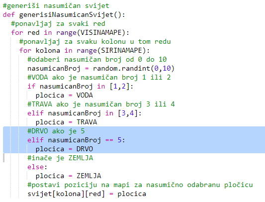

## Kreiranje novog resursa - drveta

Kreirajmo novi resurs - drvo. Da bismo to napravili, moramo dodati još neke promjenljive u tvoju datoteku `variables.py`.

+ Prvo treba da dodijeliš broj svom novom resursu. Tada ćeš u svom kôdu moći da koristiš riječ `DRVO` umjesto broja 4.
    
    

+ Dodaj novi resurs `DRVO` u svoju listu `resursi`.
    
    

+ Takođe, svom resursu treba da daš naziv koji će biti prikazan u inventaru.
    
    
    
    Obrati pažnju na zarez `,` na kraju reda.

+ Tvom resursu će biti potrebna i slika. The project already includes an image called `wood.gif`, which you should add to the `textures` dictionary.
    
    

+ Dodaj količinu resursa koja bi trebalo da se nalazi u tvom `inventaru` na početku.
    
    

+ Na kraju, dodaj taster kojim ćeš postavljati drvo u svijet.
    
    

+ Pokreni i isprobaj svoj projekat. Vidjećeš da sada imaš novi resurs 'drvo' u svom inventaru.
    
    

+ U tvom svijetu nema drva! Da to popraviš, klikni na datoteku `main.py` i pronađi funkciju `generisiNasumicanSvijet()`.
    
    
    
    Ovaj kôd generiše nasumičan broj između 0 i 10 i koristi taj broj da odluči koji resurs će biti postavljen:
    
    + 1 ili 2 = voda
    + 3 ili 4 = trava
    + bilo šta drugo = ZEMLJA

+ Unesi sljedeći kôd kako bi drvo bilo dodato u tvoj svijet svaki put kada je `nasumicanBroj` 5.
    
    

+ Ponovo isprobaj svoj projekat. Ovoga puta bi trebalo da vidiš drva u svom svijetu.
    
    