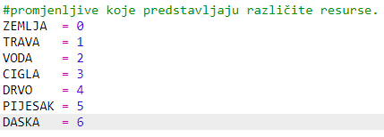
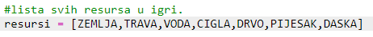
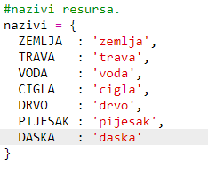
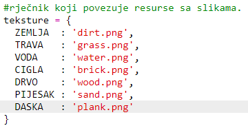
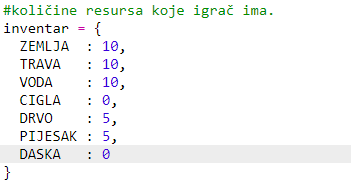
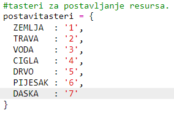
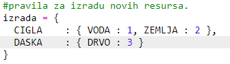
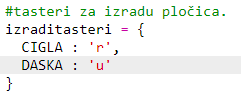

## Izrada dasaka od drva

Napravimo novi resurs, dasku, koja može biti izrađena od drva.

+ Prvo dodaj u svoju igru novu promjenljivu `DASKA`.
    
    

+ Dodaj novu promjenljivu `DASKA` u svoju igru.
    
    

+ Resursu daj naziv `'daska'`.
    
    

+ Resursu `DASKA` dodijeli sliku. Projekat već sadrži sliku `plank.gif`, ali možeš da napraviš sopstvenu sliku ako želiš.
    
    

+ Dodaj daske u svoj inventar.
    
    

+ Odredi taster za postavljanje dasaka.
    
    

+ S obzirom na to da ovaj resurs može biti izrađen od drugih resursa, treba da definišeš pravilo za izradu: da daska može biti izrađena od tri pločice drveta. Dodaj ovaj kôd u svoj rječnik `izrada`.
    
    

+ Na kraju, treba da odrediš taster za izradu novih dasaka.
    
    

+ Da isprobaš svoj novi resurs - dasku, sakupi nekoliko pločica drveta i od njih izradi daske. Zatim postavi nove daske u svoj svijet.
    
    