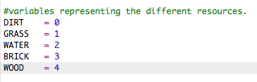
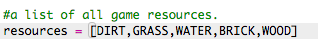
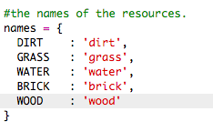
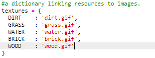
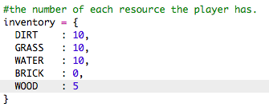
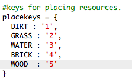
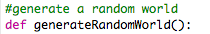

## नवीन लाकूड संसाधने तयार करा

चला नवीन लाकूड संसाधने तयार करूया. हे करण्यासाठी, आपल्या `variables.py` फाईल मध्ये आपल्याला काही चल जोडणे आवश्यक आहे.

+ प्रथम, आपल्याला आपल्या नवीन संसाधनास एक नंबर देणे आवश्यक आहे. त्यानंतर आपण `WOOD` शब्द वापरण्यास सक्षम व्हाल, आपल्या कोडमध्ये 4 नंबर ऐवजी.
    
    

+ आपण आपले नवीन `WOOD` जोडावे आपल्या संसाधनेच्या सूचीत `संसाधने`.
    
    

+ आपण आपल्या संसाधनास एक नाव देखील दिले पाहिजे, जे यादीमध्ये दिसून येईल.
    
    
    
    स्वल्पविराम लक्षात घ्या `,` वरील ओळीच्या शेवटी.

+ आपल्या संसाधनास प्रतिमेची देखील आवश्यकता असेल. प्रकल्पात आधीपासून `wood.gif` नावाची प्रतिमा समाविष्ट आहे, जे आपण जोडले पाहिजे `textures` शब्दकोश.

    

आपल्या संसाधनाची संख्या जोडा जी आपल्या `inventory` मध्ये असावी सुरुवात करण्यासाठी.
    
    

+ शेवटी, आपण जगात लाकूड ठेवण्यासाठी दाबत असलेली key जोडा.
    
    

+ तुमच्या कोड ची चाचणी घेण्यासाठी प्रकल्प चालवुन बघा. आपल्या सूचीमध्ये आता आपल्याकडे नवीन 'wood' संसाधन आहे हे आपल्याला दिसेल.
    
    

+ आपल्या जगात लाकूड नाही! याचे निराकरण करण्यासाठी आपल्या `main.py` वर क्लिक करा आणि `generateRandomWorld()` नावाचे फंक्शन फाइल करा आणि शोधा.
    
    
    
    हा कोड 0 आणि 10 दरम्यान यादृच्छिक (random) संख्या व्युत्पन्न (generates) करतो आणि कोणत्या संसाधनेचे ठेवायचे हे ठरवण्यासाठी नंबरचा वापर करतो:
    
    + 1 or 2 = water
    + 3 or 4 = grass
    + anything else = DIRT

+ जेव्हा `randomNumber` असेल तेव्हा आपल्या जगात लाकूड जोडण्यासाठी हा कोड जोडा 5 आहे.
    
    

+ आपल्या कोडची पुन्हा चाचणी घ्या. यावेळी, आपण आपल्या जगात काही लाकूड दिसले पाहिजे.
    
    