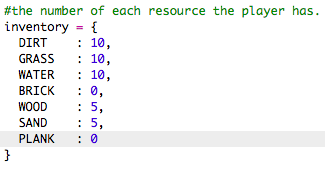

## लाकडापासून फळी तयार करणे

चला एक नवीन फळी संसाधन तयार करू जे लाकडापासून बनविले गेले.

+ प्रथम, नवीन `PLANK` जोडा आपल्या खेळासाठी चल.
    
    

+ जोडा नवीन `PLANK` आपल्या खेळासाठी चल.
    
    

+ संसाधनास नाव द्या `'plank'`.
    
    

+ आपले `PLANK` द्या संसाधने प्रतिमा. प्रकल्पात आधीपासून `plank.gif` समाविष्ट आहे.प्रतिमा, परंतु आपण प्राधान्य दिल्यास आपण आपले तयार आणि अपलोड करू शकता.
    
    

+ आपल्या यादीमध्ये फळी (planks) जोडा.
    
    

+ फळी ठेवण्यासाठी एक किल्ली(key) सेट करा.
    
    

+ हे संसाधन तयार केले जाऊ शकते म्हणून, आपल्याला एक हस्तकला नियम तयार करण्याची आवश्यकता आहे, म्हणजे 3 लाकडी टाईलपासून एक फळी बनविली जाऊ शकते. हा कोड जोडा `crafting` शब्दकोश.
    
    

+ शेवटी, आपल्याला नवीन फळी तयार करण्यासाठी एक की सेट करणे आवश्यक आहे.
    
    

+ आपल्या नवीन फळीच्या संसाधनाची चाचणी घेण्यासाठी, काही लाकडी टाईल एकत्र करा आणि नंतर आपल्या लाकडापासून काही फळी तयार करा. त्यानंतर आपण आपल्या जगात आपले नवीन फळी ठेवू शकता.
    
    