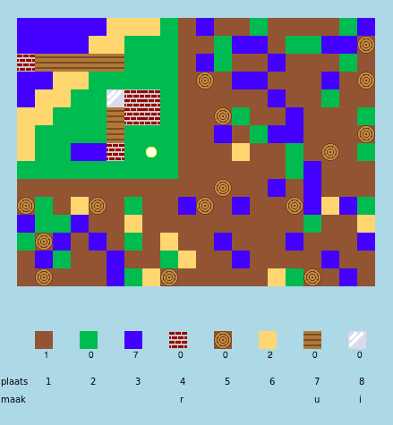

## Inleiding

In dit project ontwerp en codeer je verbeteringen aan een 2D-versie van Minecraft.

  <iframe src="https://trinket.io/embed/python/ebc5b0148b?outputOnly=true&start=result" width="600" height="500" frameborder="0" marginwidth="0" marginheight="0" allowfullscreen>
  </iframe>
  

### Aanvullende informatie voor clubleiders

Als je dit project wilt afdrukken, gebruik dan de [printervriendelijke versie](https://projects.raspberrypi.org/en/projects/codecraft/print).

## \--- collapse \---

## title: Clubleider notities

## Inleiding:

In dit project leren kinderen aspecten van grafische vormgeving en gamedesign door verbeteringen aan te brengen in een standaard 2D Minecraft-kloon. Kinderen zullen nieuwe bronnen creëren en maakregels gebruiken om bestaande bronnen samen te voegen tot nieuwe. Dit wordt bereikt door variabelen, lijsten en woordenboeken te begrijpen en te manipuleren.

## Online bronnen

**Dit project maakt gebruik van Python 3.** We raden aan om [trinket](https://trinket.io/) te gebruiken om online Python te schrijven. Dit project bevat de volgende Trinkets:

+ ['CodeCraft' startproject -- rpf.io/codecraft-on](http://rpf.io/codecraft-on)

Er is ook een trinket met het voltooide project:

+ ['CodeCraft' gereed - trinket.io/python/ebc5b0148b](https://trinket.io/python/ebc5b0148b)

## Offline bronnen

Dit project kan [offline worden voltooid](https://www.codeclubprojects.org/en-GB/resources/python-working-offline/) als dit de voorkeur heeft. Je kunt toegang krijgen tot de projectbronnen door op de koppeling 'Projectmaterialen' voor dit project te klikken. Deze link bevat een 'Projectbronnen'-sectie die bronnen bevat om dit project offline te voltooien. Zorg ervoor dat elk kind toegang heeft tot een kopie van deze bronnen. Deze sectie bevat de volgende bestanden:

+ codecraft/codecraft.py
+ codecraft / variables.py
+ codecraft/brick.gif
+ codecraft/dirt.gif
+ codecraft/glass.gif
+ codecraft/grass.gif
+ codecraft/plank.gif
+ codecraft/player.gif
+ codecraft/sand.gif
+ codecraft/water.gif
+ codecraft/wood.gif

Je kunt ook een voltooide versie van dit project vinden in de sectie 'Vrijwilligersbronnen', die het volgende bevat:

+ codecraft-finished/codecraft.py
+ codecraft-finished/variables.py
+ codecraft-finished/brick.gif
+ codecraft-finished/dirt.gif
+ codecraft-finished/glass.gif
+ codecraft-finished/grass.gif
+ codecraft-finished/plank.gif
+ codecraft-finished/player.gif
+ codecraft-finished/sand.gif
+ codecraft-finished/water.gif
+ codecraft-finished/wood.gif

(Alle bovenstaande bronnen kunnen ook worden gedownload als `.zip` bestanden.)

## Leerdoelen

+ Afbeeldingen maken en bewerken;
+ Spelontwerp
+ Bewerken: 
    + Variabelen;
    + Lijsten;
    + Woordenboeken.

Dit project behandelt elementen uit de volgende onderdelen van het [Raspberry Pi Digital Making Curriculum](http://rpf.io/curriculum):

+ [Ontwerp standaard 2D- en 3D-middelen.](https://www.raspberrypi.org/curriculum/design/creator)

+ [Combineer programmeerconstructies om een ​​probleem op te lossen.](https://www.raspberrypi.org/curriculum/programming/builder)

## Uitdagingen

+ "Bouw je wereld" - Speel het spel, plaats en maak bestaande blokken;
+ "Verander de grootte van de wereld" - bewerk de `MAPBREEDTE` en `MAPHOOGTE` variabelen om de grootte van de wereld te veranderen;
+ "Zand maken" - Een nieuwe zandbron maken, samen met bijbehorende gamegegevens.
+ "Maak glas van zand" - Een nieuwe bruikbare glasbron maken.
+ "Meer bronnen maken" - Gebruik wat is geleerd om meer blokken en regels voor het creëren ervan te maken.

## Veelgestelde vragen (faq)

+ Kinderen moeten er mogelijk aan herinnerd worden dat elementen van een woordenboek/lijst moeten worden gescheiden door een komma. Bijvoorbeeld bij het toevoegen van voorraaditems, afbeeldingen en maakregels aan het spel.

\--- /collapse \---

## \--- collapse \---

## title: Projectmaterialen

## Projectbronnen

+ [.zip-bestand met alle projectbronnen](http://rpf.io/p/en/codecraft-go)
+ [Online Trinket met alle 'CodeCraft' projectbronnen](http://rpf.io/codecraft-on)

## Clubleiderbronnen

+ [.zip-bestand met alle voltooide projectresources](http://rpf.io/p/en/codecraft-get)
+ [Online voltooid Trinket-project](https://trinket.io/python/ebc5b0148b)

\--- /collapse \---