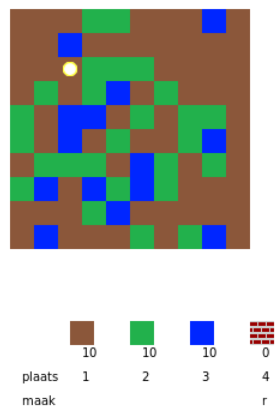
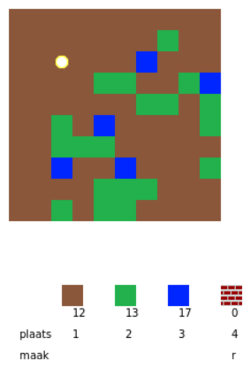
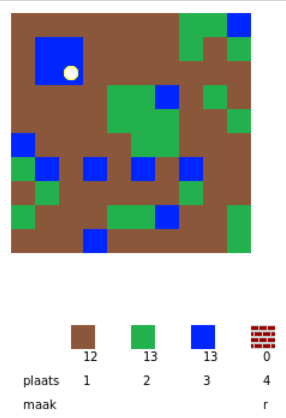
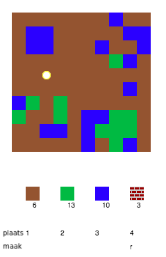
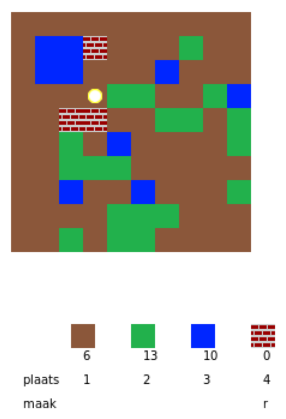

## Speel het spel

+ Open deze trinket: <a href="https://trinket.io/python/a4cdd53d10" target="_blank">jumpto.cc/codecraft-go</a>.

+ Gebruik de WASD-toetsen om je speler in de wereld rond te laten lopen, die vol zit met verschillende bronnen (vuil, gras en water).
    
    

+ Je kunt op de spatiebalk drukken om bronnen te verzamelen. Pak enkele brontypes op en zie dat ze aan je inventaris worden toegevoegd.
    
    

+ Druk op de cijfertoetsen (1 tot 3) om een ​​bron op de kaart te plaatsen. Druk bijvoorbeeld op 3 om wat water op de kaart te plaatsen. Dit werkt alleen als je wat water in je inventaris hebt.
    
    

+ Je kunt een item maken door op de toets te drukken die in het menu wordt weergegeven. 'Maken' betekent het combineren van items, die je al in je inventaris hebt, om nieuwe te maken. Druk op de 'r'-toets om een ​​nieuwe steen te maken (zolang je 2 vuil en 1 water in je inventaris hebt).
    
    

+ Je kunt dan op de '4'-toets drukken om je gemaakte stenen te plaatsen.
    
    
