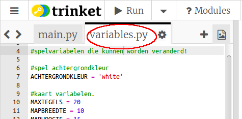
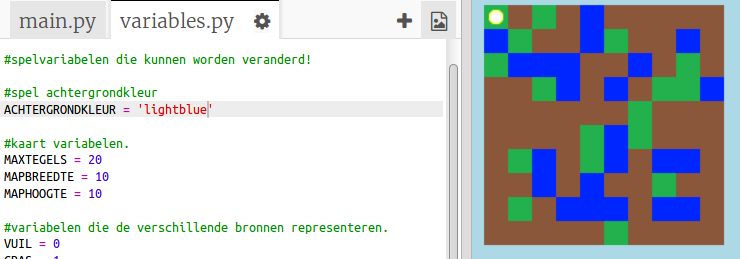
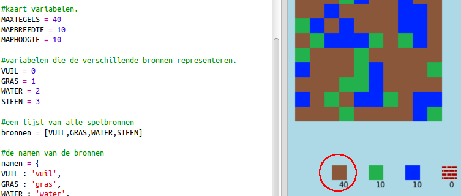

## Je spel aanpassen

Laten we enkele variabelen aanpassen om je spel te te veranderen.

+ Klik op het `variables.py` bestand om enkele variabelen te bekijken die kunnen worden gewijzigd.
    
    

+ Wijzig de waarde van de `ACHTERGRONDKLEUR` variabele en klik op 'Run' om de wijziging in je spel te zien.
    
    

+ De variabele `MAXTEGELS` is de hoeveelheid van elke bron die je in je voorraad kunt houden. Wijzig deze variabele als je meer (of minder) dan 20 van elke bron wilt opslaan.
    
    