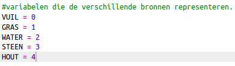
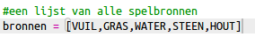
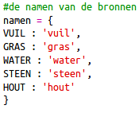
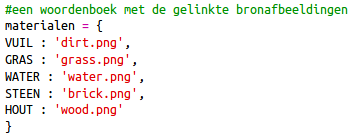
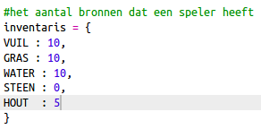
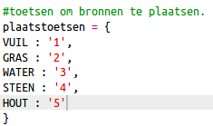
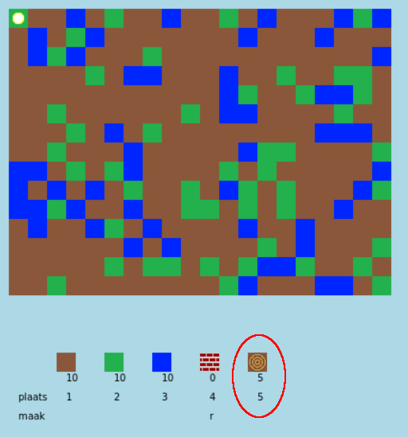
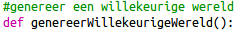

## Maak een nieuwe bron voor hout

Laten we een nieuwe bron voor hout creëren. Daarvoor moet je enkele variabelen in het bestand `variables.py` toevoegen.

+ Eerst moet je de nieuwe bron een nummer geven. Je kunt dan het woord `HOUT` gebruiken in het programma, in plaats van nummer 4.
    
    

+ Je moet de nieuwe bron `HOUT` toevoegen aan je lijst met `bronnen`.
    
    

+ Je moet de bron ook een naam geven die in de inventaris wordt weergegeven.
    
    
    
    Let op de komma `,` aan het einde van de regel hierboven.

+ Je bron heeft ook een afbeelding nodig. Het project bevat al een afbeelding met de naam `wood.png`, die je zou moeten toevoegen aan het `materialen` woordenboek.
    
    

+ Om te beginnen voeg je het nummer van de bron toe aan de `inventaris`.
    
    

+ Voeg tenslotte de toets toe die je wilt gebruiken om hout in de wereld te plaatsen.
    
    

+ Voer je project uit om het te testen. Je zult zien dat je nu een nieuwe 'hout' bron in je inventaris hebt.
    
    

+ Er is geen hout in jouw wereld! Om dit op te lossen, klikt je op je `main.py` bestand en zoekt je de functie `genereerWillekeurigeWereld()`.
    
    
    
    Deze code genereert een willekeurig getal tussen 0 en 10 en gebruikt het nummer om te bepalen welke bron moet worden geplaatst:
    
    + 1 of 2 = water
    + 3 of 4 = gras
    + iets anders = VUIL

+ Voeg deze code toe om hout aan je wereld toe te voegen wanneer `willekeurigGetal` 5 is.
    
    

+ Test je project opnieuw. Deze keer zou je wat hout in je wereld moeten zien verschijnen.
    
    