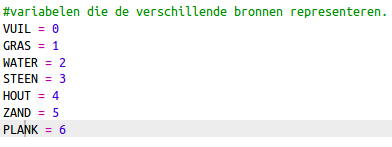
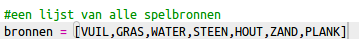
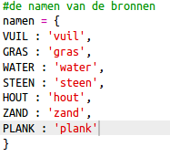
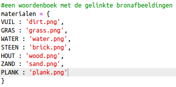
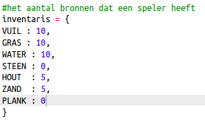
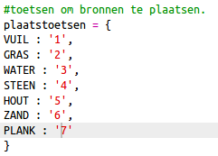
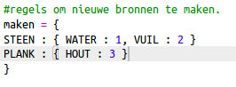
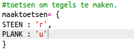

## Planken maken van hout

Laten we een nieuw plankmateriaal van hout maken.

+ Voeg eerst een nieuwe `PLANK` variabele toe aan je game.
    
    

+ Voeg een nieuwe `PLANK` variabele toe aan je game.
    
    

+ Noem de bron `'plank'`.
    
    

+ Geef je `PLANK` bron een afbeelding. The project already contains a `plank.gif` image, but you can create your own if you prefer.
    
    

+ Voeg planken toe aan je inventaris.
    
    

+ Bepaal met welke toets je planken neerzet.
    
    

+ Omdat deze bron kan worden gemaakt, moet je een maakregel maken, namelijk dat een plank kan worden gemaakt van 3 tegels hout. Voeg deze code toe aan het `maken` woordenboek.
    
    

+ Ten slotte moet je een toets instellen voor het maken van nieuwe planken.
    
    

+ Om de nieuwe bron plank te testen verzamel je een paar tegels hout en maak je planken van het hout. Dan kun je de nieuwe planken in je wereld plaatsen.
    
    