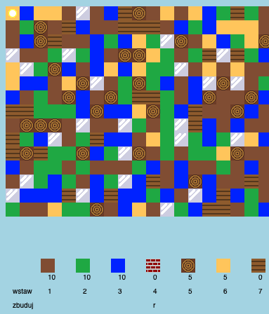

## Wprowadzenie

W tym projekcie będziesz projektować i kodować ulepszenia w 2D wersji Minecrafta.

  <iframe src="https://trinket.io/embed/python/578a95bce4?outputOnly=true&start=result" width="600" height="500" frameborder="0" marginwidth="0" marginheight="0" allowfullscreen>
  </iframe>
  

### Dodatkowe informacje dla prowadzących klub

Jeśli chcesz wydrukować ten projekt, użyj [wersji do druku](https://projects.raspberrypi.org/pl-PL/projects/codecraft/print).

--- collapse ---
---
title: Notatki dla prowadzących klub
---

## Wprowadzenie:

W tym projekcie dzieci poznają aspekty grafiki i projektowania gier, wprowadzając ulepszenia do podstawowego klona 2D Minecrafta. Dzieci będą tworzyć nowe zasoby, a także reguły łączenia zasobów w celu utworzenia nowych. Do osiągnięcia celu potrzebne będzie zrozumienie zasad użycia zmiennych, list i słowników.

## Zasoby Online

**Ten projekt używa języka Python 3.** Do pisania kodu w Pythonie zalecamy użycie edytora [trinket](https://trinket.io/). Ten projekt zawiera następujące szablony:

+ [„CodeCraft” – projekt wyjściowy -- trinket.io/python/d4a7d66f1a](https://trinket.io/python/d4a7d66f1a)

Jest też Trinket zawierający ukończony projekt:

+ [„CodeCraft” – projekt ukończony -- trinket.io/python/578a95bce4](https://trinket.io/python/578a95bce4)

## Zasoby Offline

Ten projekt można także [wykonać offline](https://www.codeclubprojects.org/en-GB/resources/python-working-offline/). Żeby pobrać materiały dotyczące projektu, kliknij w odnośnik „Materiały do projektu". Ten odnośnik zawiera sekcję "Zasoby", których dzieci będą potrzebować, aby ukończyć ten projekt bez dostępu do sieci. Upewnij się, że każde dziecko ma dostęp do kopii tych zasobów. Ta sekcja zawiera następujące pliki:

+ codecraft/codecraft.py
+ codecraft/variables.py
+ codecraft/brick.gif
+ codecraft/dirt.gif
+ codecraft/glass.gif
+ codecraft/grass.gif
+ codecraft/plank.gif
+ codecraft/player.gif
+ codecraft/sand.gif
+ codecraft/water.gif
+ codecraft/wood.gif

Ukończoną wersję tego projektu można również znaleźć w sekcji "Zasoby dla wolontariuszy", która zawiera:

+ codecraft-finished/codecraft.py
+ codecraft-finished/variables.py
+ codecraft-finished/brick.gif
+ codecraft-finished/dirt.gif
+ codecraft-finished/glass.gif
+ codecraft-finished/grass.gif
+ codecraft-finished/plank.gif
+ codecraft-finished/player.gif
+ codecraft-finished/sand.gif
+ codecraft-finished/water.gif
+ codecraft-finished/wood.gif

(Wszystkie powyższe zasoby można również pobrać jako archiwa `ZIP`).

## Cele dydaktyczne

+ Tworzenie i edycja grafiki.
+ Projektowanie gry.
+ Edycja: 
    + zmiennych,
    + Listy;
    + słowników.

Ten projekt obejmuje zagadnienia zawarte w [Programie nauczania Raspberry Pi Digital Making](https://rpf.io/curriculum):

+ [Projektowanie podstawowych obiektów 2D i 3D.](https://www.raspberrypi.org/curriculum/design/creator)

+ [Łączenie struktur programistycznych, w celu rozwiązania zadania.](https://www.raspberrypi.org/curriculum/programming/builder)

## Zadania

+ „Tworzenie własnego świata” – granie w grę, umieszczanie i wytwarzanie bloków.
+ „Zmiana rozmiarów świata” - edycja zmiennych `SZEROKOSCMAPY` i `WYSOKOSCMAPY`, w celu modyfikacji rozmiarów świata;
+ „Tworzenie piasku” - tworzenie nowego zasobu piasku wraz z powiązanymi właściwościami.
+ "Wytwarzanie szkła z piasku" - Tworzenie nowego, nadającego się do ręcznego wytwarzania szkła.
+ „Tworzenie nowych zasobów” - użycie zdobytej wiedzy do tworzenia nowych bloków i zasad ich wytwarzania.

## Najczęściej Zadawane Pytania

+ Warto dzieciom przypominać, że elementy list i słowników należy oddzielać przecinkami, np. gdy będą dodawać elementy do ekwipunku, obrazy, czy zasady wytwarzania.

--- /collapse ---

--- collapse ---
---
title: Materiały do projektu
---

## Zasoby projektu

+ [Plik .zip zawierający wszystkie zasoby potrzebne do wykonania projektu](resources/codecraft-resources.zip)
+ [Trinket zawierający wszystkie zasoby projektu „CodeCraft”.](https://trinket.io/python/d4a7d66f1a)

## Zasoby dla lidera klubu

+ [Plik .zip zawierający zasoby z ukończonym projektem](solutions/codecraft-solution.zip)
+ [Trinket zawierający wszystkie zasoby ukończonego projektu „CodeCraft”.](https://trinket.io/python/578a95bce4)

--- /collapse ---
