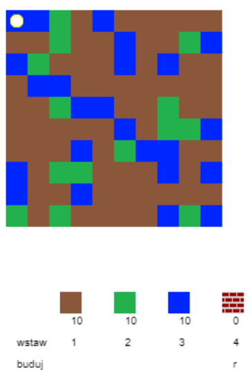
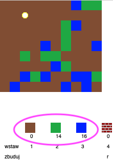
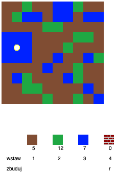
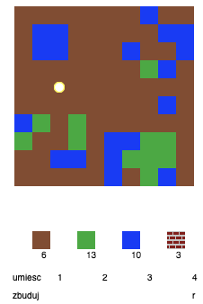
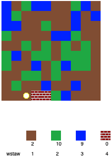

## Zasady gry

+ Otwórz Trinket: [trinket.io/python/d4a7d66f1a](https://trinket.io/python/d4a7d66f1a){:target="_blank"}.

+ Do poruszania się po świecie pełnym różnych zasobów (ziemia, trawa, czy woda) użyj klawiszy WSAD.
    
    

+ Możesz nacisnąć spację, aby zebrać zasoby. Zbierz kilka rodzajów zasobów, a zobaczysz je w swoim ekwipunku.
    
    

+ Naciśnij klawisze numeryczne (od 1 do 3), aby umieścić zasoby na mapie. Na przykład naciśnij 3, aby umieścić trochę wody na mapie. To zadziała tylko, jeśli masz trochę wody w ekwipunku.
    
    

+ Możesz stworzyć przedmiot, naciskając klawisz wyświetlony w menu. Tworzenie to łączenie przedmiotów, które już masz w ekwipunku, w celu zbudowania nowych. Gdy będziesz mieć co najmniej 2 sztuki ziemi oraz 1 wody, naciśnij klawisz „r”, aby zbudować nową cegłę.
    
    

+ Swoje cegły umieścisz na mapie, naciskając klawisz „4”.
    
    