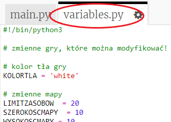
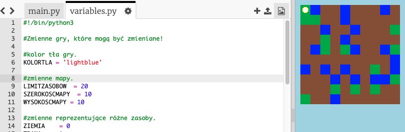
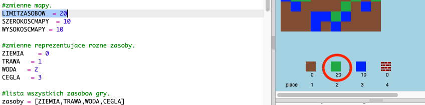

## Modyfikacja własnej gry

Zmodyfikujmy niektóre zmienne, aby zmienić sposób działania Twojej gry.

+ Kliknij plik `variables.py` , aby wyświetlić zmienne, które można zmienić.
    
    

+ Zmień wartość zmiennej `KOLORTLA` i kliknij „Run” (ang. uruchom), aby zobaczyć co się zmieniło w Twojej grze.
    
    

+ Zmienna `LIMITZASOBOW` określa jak dużo zasobów każdego typu można przechowywać w ekwipunku. Zmień wartość tej zmiennej, jeśli chcesz przechowywać więcej (lub mniej) niż 20 sztuk każdego z zasobów.
    
    