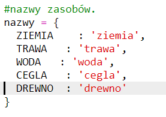

## Tworzenie nowego zasobu drewna

Stwórzmy nowy zasób drewna. Aby to zrobić, musisz dodać do niektórych zmiennych w pliku `variables.py`.

+ Najpierw musisz podać nowy zasób liczbowy. Będziesz wówczas mógł używać słowa `WOOD` w swoim kodzie zamiast numeru 4.
    
    

+ Powinieneś dodać swój nowy `WOOD` do swojej listy `zasobów`.
    
    

+ Powinieneś również nadać zasobowi nazwę, która będzie wyświetlana w ekwipunku.
    
    
    
    Zauważ przecinek `,` na końcu powyższej linii.

+ Twój zasób będzie również potrzebował obrazu. Projekt zawiera już obraz o nazwie `wood.png`, który powinieneś dodać do słownika `tekstur`.
    
    

+ Add the number of your resource that should be in your `inventory` to start with.
    
    

+ Na koniec dodaj klucz, który będziesz naciskał, aby umieścić drewno na świecie.
    
    

+ Uruchom swój projekt, aby go przetestować. Zobaczysz, że masz teraz nowy "drzewny" zasób w ekwipunku.
    
    

+ W waszym świecie nie ma drewna! Aby to naprawić, kliknij swój `plik main.py` i znajdź funkcję o nazwie `generateRandomWorld ()`.
    
    
    
    Ten kod generuje losową liczbę z zakresu od 0 do 10 i używa tej liczby do określenia, który zasób należy umieścić:
    
    + 1 lub 2 = woda
    + 3 lub 4 = trawa
    + cokolwiek innego = DIRT

+ Dodaj ten kod, aby dodać drewno do swojego świata, gdy `randomNumber` ma wartość 5.
    
    

+ Przetestuj swój projekt ponownie. Tym razem powinieneś zobaczyć trochę drewna pojawiającego się w twoim świecie.
    
    