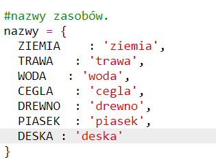

## Wytwarzanie desek z drewna

Stwórzmy nowy zasób – deskę (ang. plank), który będzie wykonany z drewna.

+ Najpierw dodaj nową zmienną `DESKA` do gry.
    
    

+ Dodaj nową zmienną `DESKA` do gry.
    
    

+ Nazwij nowy zasób `„deska”`.
    
    

+ Przypisz obrazek zasobowi `DESKA`. W projekcie jest już obrazek `plank.gif`, ale jeśli chcesz, możesz dodać własny i go użyć.
    
    

+ Dodaj deski do ekwipunku.
    
    

+ Ustaw klawisz, którym będziesz wstawiać deski na mapie.
    
    

+ Należy utworzyć reguły budowania zasobu, skoro może on być wytwarzany. Deskę można zbudować z 3 sztuk drewna. Dodaj ten kod do słownika `tworzenie`.
    
    

+ Na koniec musisz przypisać klawisz do tworzenia nowych desek.
    
    

+ Aby przetestować nowy zasób, zbierz kilka sztuk drewna, a następnie zbuduj z nich deski. Teraz możesz wstawić deski w swoim świecie.
    
    