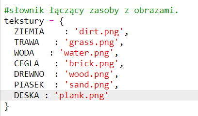
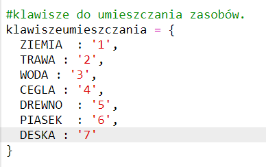

## Wytwarzanie desek z drewna

Stwórzmy nowy materiał deski, który będzie wykonany z drewna.

+ First, add a new `PLANK` variable to your game.
    
    

+ Add a new `PLANK` variable to your game.
    
    

+ Nazwij zasób `"deskę"`.
    
    

+ Podaj swój `PLANK` zasób obraz. The project already contains a `plank.gif` image, but you can create your own if you prefer.
    
    

+ Dodaj deski do ekwipunku.
    
    

+ Ustaw klucz do układania desek.
    
    

+ Ponieważ ten zasób może zostać stworzony, musisz stworzyć regułę tworzenia, która polega na tym, że deskę można wykonać z 3 drewnianych płytek. Dodaj ten kod do słownika `crafting`.
    
    

+ Na koniec musisz ustawić klucz do tworzenia nowych desek.
    
    

+ Aby przetestować nowy zasób deski, zebrać kilka drewnianych płytek, a następnie wykuć deski z drewna. Możesz wtedy umieścić swoje nowe deski w swoim świecie.
    
    