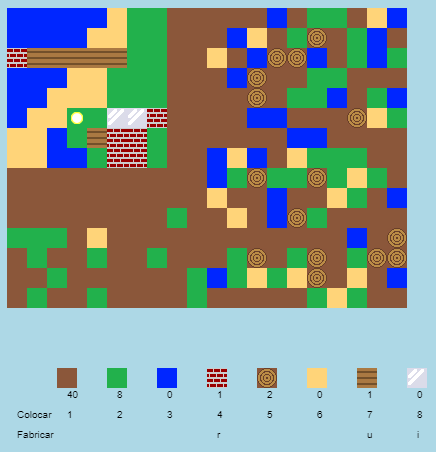

## Introdução

Neste projeto, você irá projetar e programar melhorias para uma versão 2D do Minecraft.

  <iframe src="https://trinket.io/embed/python/ebc5b0148b?outputOnly=true&start=result" width="600" height="500" frameborder="0" marginwidth="0" marginheight="0" allowfullscreen>
  </iframe>
  

### Informação adicional para os líderes dos clubes

Se você precisar imprimir este projeto, use a [versão para impressão](https://projects.raspberrypi.org/en/projects/codecraft/print).

## \--- collapse \---

## título: Notas do líder do clube

## Introdução:

Neste projeto, as crianças aprenderão aspectos de gráficos e design de jogos, aprimorando um clone básico do Minecraft em 2D. As crianças criarão novos recursos, além de criar regras para combinar recursos para criar novos. Isto será alcançado através da compreensão e manipulação de variáveis, listas e dicionários.

## Recursos online

**Este projeto usa o Python 3.** Recomendamos usar [trinket](https://trinket.io/) para escrever Python online. Este projeto contém os seguintes Trinkets:

+ [Ponto de partida 'CodeCraft' - rpf.io/codecraft-on](http://rpf.io/codecraft-on)

Há também uma trinket contendo o projeto concluído:

+ ['CodeCraft' concluído - trinket.io/python/ebc5b0148b](https://trinket.io/python/ebc5b0148b)

## Recursos offline

Este projeto pode ser [concluído off-line](https://www.codeclubprojects.org/en-GB/resources/python-working-offline/) , se preferir. Você pode acessar os recursos do projeto clicando no link 'Materiais do Projeto' para este projeto. Este link contém uma seção "Recursos do Projeto", que inclui recursos que as crianças precisarão para concluir esse projeto off-line. Certifique-se de que cada criança tenha acesso a uma cópia desses recursos. Esta seção inclui os seguintes arquivos:

+ codecraft/codecraft.py
+ codecraft/variables.py
+ codecraft/brick.gif
+ codecraft/dirt.gif
+ codecraft/glass.gif
+ codecraft/grass.gif
+ codecraft/plank.gif
+ codecraft/player.gif
+ codecraft/sand.gif
+ codecraft/water.gif
+ codecraft/wood.gif

Você também pode encontrar uma versão completa deste projeto na seção 'Recursos para Voluntários', que contém:

+ codecraft-finished/codecraft.py
+ codecraft-finished/variables.py
+ codecraft-finished/brick.gif
+ codecraft-finished/dirt.gif
+ codecraft-finished/glass.gif
+ codecraft-finished/grass.gif
+ codecraft-finished/plank.gif
+ codecraft-finished/player.gif
+ codecraft-finished/sand.gif
+ codecraft-finished/water.gif
+ codecraft-finished/wood.gif

(Todos os recursos acima também podem ser baixados como arquivos `.zip` do projeto e dos voluntários.)

## Objetivos de aprendizado

+ Criar e editar gráficos;
+ Design de jogo;
+ Edição: 
    + Variáveis;
    + Listas;
    + Dicionários

Este projeto abrange elementos das seguintes vertentes do [Currículo de Criação Digital Raspberry Pi](http://rpf.io/curriculum):

+ [Projetar designs básicos em 2D e 3D.](https://www.raspberrypi.org/curriculum/design/creator)

+ [Combinar as estruturas de programação para resolver um problema.](https://www.raspberrypi.org/curriculum/programming/builder)

## Desafios

+ "Construir o seu mundo" - Jogando o jogo, colocando e fabricando blocos;
+ "Altere o tamanho do seu mundo" - editando as variáveis ​​ `LARGURA_MAPA` e `ALTURA_MAPA` para alterar o tamanho do mundo;
+ "Criar areia" - Criar um novo recurso, a areia.
+ "Faça vidro a partir da areia" - Criar um novo recurso, o vidro.
+ "Criar mais recursos" - Use o que foi aprendido para criar mais recursos e as regras para cada um deles.

## Perguntas Frequentes

+ As crianças podem precisar de lembrar que os elementos de um dicionário / lista são separados por uma vírgula. Por exemplo, ao adicionar itens de inventário, gráficos e regras de criação ao jogo.

\--- /collapse \---

## \--- collapse \---

## Título: Materiais do projeto

## Recursos do projeto

+ [Arquivo .zip contendo todos os recursos do projeto](http://rpf.io/p/en/codecraft-go)
+ [Trinket Online contendo todos os recursos do projeto 'CodeCraft'](http://rpf.io/codecraft-on)

## Recursos do líder do clube

+ [Arquivo .zip contendo todos os recursos do projeto concluídos](http://rpf.io/p/en/codecraft-get)
+ [Trinket Online contendo o projeto concluído](https://trinket.io/python/ebc5b0148b)

\--- /collapse \---