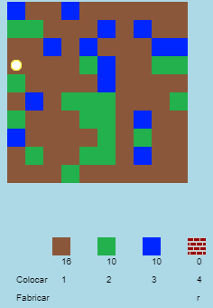
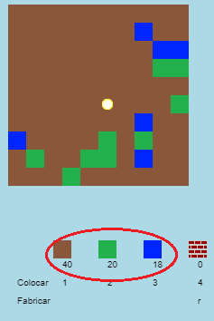
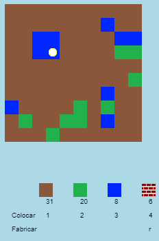
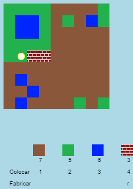
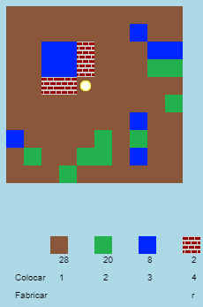

## Jogando o jogo

+ Abra este template trinket: [rpf.io/codecraft-on](https://rpf.io/codecraft-on){:target="_blank"}.

+ Use as teclas WASD para mover o seu jogador ao redor do mundo, que é cheio de recursos diferentes (terra, grama e água).
    
    

+ Você pode pressionar a barra de espaço para coletar recursos. Escolha alguns blocos de cada tipo de recurso e você os verá adicionados ao seu inventário.
    
    

+ Pressione as teclas numéricas (1 a 3) para colocar um recurso no mapa. Por exemplo, pressione 3 para colocar um pouco de água no mapa. Isso só funcionará se você tiver um pouco de água no seu inventário.
    
    

+ Você pode criar um item pressionando a tecla exibida no menu. Criar significa combinar itens que você já possui em seu inventário para criar itens novos. Tente pressionar a tecla 'r' para criar um novo tijolo (você precisará de 2 blocos de terra e 1 bloco de água no seu inventário).
    
    

+ Você pode pressionar a tecla '4' para colocar seus tijolos recém criados.
    
    
