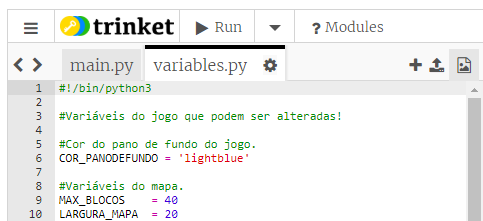
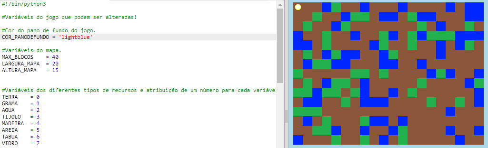
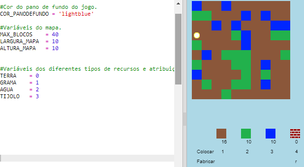

## Personalizando o seu jogo

Vamos modificar algumas variáveis ​​para mudar o funcionamento do seu jogo.

+ Clique no arquivo `variables.py` para ver algumas variáveis ​​que podem ser alteradas.
    
    

+ Altere o valor da sua variável `COR_PANODEFUNDO` e clique em 'Run' para ver a alteração no seu jogo.
    
    

+ A variável `MAX_BLOCOS` é a quantidade de cada recurso que pode ser mantido em seu inventário. Altere esta variável se você quiser armazenar uma quantidade maior ou menor que 20 de cada recurso.
    
    