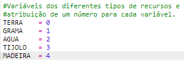
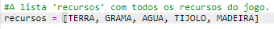
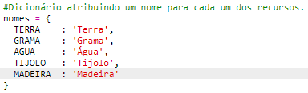
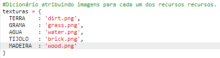
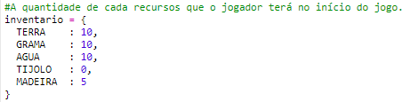
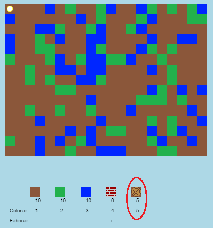
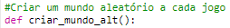
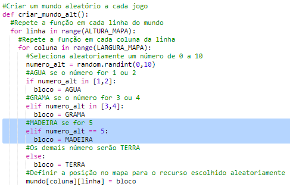

## Criando um novo recurso: Madeira

Vamos criar um novo recurso, a madeira. Para fazer isso, você precisará adicionar algumas variáveis ​​em seu arquivo `variables.py`.

+ Primeiro, você precisa dar um novo número ao seu novo recurso. Você poderá usar a palavra `MADEIRA` em seu código, em vez do número 4.
    
    

+ Você deve adicionar seu novo recurso `MADEIRA` à sua lista de `recursos`.
    
    

+ Você também deve dar um nome ao seu recurso, que será exibido no inventário.
    
    
    
    Observe a vírgula `,` no final da linha acima.

+ Seu recurso também precisará de uma imagem. O projeto já inclui uma imagem chamada `wood.gif`, que você deve adicionar ao dicionário de `texturas`.
    
    

+ Adicione o número do seu recurso deve estar no `inventário` para começar.
    
    

+ Por fim, adicione a tecla que você pressionará para colocar o bloco 'Madeira' no mundo.
    
    

+ Execute seu projeto para testá-lo. Você verá que agora tem um novo recurso chamado "madeira" em seu inventário.
    
    

+ Não há madeira no seu mundo! Para corrigir isso, clique no seu arquivo `main.py` e encontre a função `criar_mundo_alt()`.
    
    
    
    Esse código gera um número aleatório entre 0 e 10 e usa o número para decidir qual recurso colocar:
    
    + 1 ou 2 = Água
    + 3 ou 4 = Grama
    + Os demais números = Terra

+ Adicione este código para adicionar madeira ao seu mundo sempre que o `numero_alt` for 5.
    
    

+ Teste o seu projeto novamente. Desta vez, você deve ver alguns blocos 'Madeira' aparecer em seu mundo.
    
    