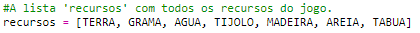
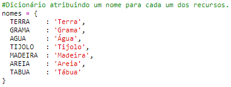
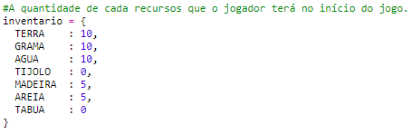
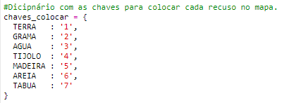
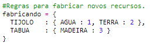
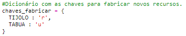

## Criar tábuas a partir da madeira

Vamos criar um novo recurso, a tábua que será criado a partir da madeira.

+ Primeiro, adicione uma nova variável `TABUA` ao seu jogo.
    
    

+ Adicione a nova variável `TABUA` à lista 'recursos'.
    
    

+ Nomeie o recurso `'Tábua'`.
    
    

+ Dê uma imagem ao seu recursos `TABUA`. The project already contains a `plank.gif` image, but you can create your own if you prefer.
    
    

+ Adicione as tábuas ao seu inventário.
    
    

+ Defina uma chave para colocar as tábuas.
    
    

+ Como este recurso pode ser trabalhado, você precisa criar uma regra de criação, que uma tábua poderá ser construída a partir de 3 blocos de madeira. Adicione este código ao dicionário `fabricando`.
    
    

+ Finalmente, você precisa definir uma chave para criar novas tábuas.
    
    

+ Para testar o seu novo recurso, junte alguns blocos de madeira e depois faça algumas tábuas. Você pode colocar as suas novas tábuas no seu mundo.
    
    