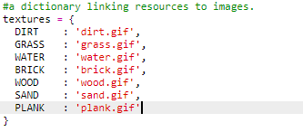

## Izdelava desk iz lesa

Usvari ustvari novo sredstvo deske, ki jih lahko narediš iz lesa.

+ Najprej dodaj novo spremeljivko `PLANK` v svojo igro.
    
    

+ Dodaj novo spremeljivko `PLANK` v svojo igro.
    
    

+ Poimenij sredstvo `'plank'`.
    
    

+ Dodaj svojemu sredstvu `PLANK` sliko. Projekt že vsebuje `plank.gif` sliko ki jo lahko uporabiš ali pa če želiš ustvariš svojo.
    
    

+ Dodaj deske v svoj inventar.
    
    

+ Dodaj tipko za postavitev desk.
    
    

+ Ker je to sredstvo mogoče izdelati, moraš ustvariti pravilo za izdelavo, to je, da za eno desko potrebuješ tri kose lesa. Dodaj to kodo v `crafting` slovar.
    
    

+ Končno, moraš dodati tipko za izdelavo desk.
    
    

+ Če hočeš preizkusiti nov vir desk, zberi nekaj kosov lesa in izdelaj iz njih desko. Nato lahko postaviš svoje nove deske v svoj svet.
    
    