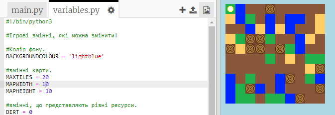

## Налаштування твоєї гри

Давай змінимо деякі змінні, щоб твоя гра працювала по-іншому.

+ Натисни на `змінна.py` файл, щоб переглянути деякі змінні, які можна змінити.
    
    

+ Зміни значення твоєї `BACKGROUNDCOLOUR` змінної та натисни "Виконати", щоб переглянути зміни у твоїй грі.
    
    

+ Змінна `MAXTILES` - це кількість кожного ресурсу, який може зберігатися у твоєму інвентарі. Зміни цю змінну, якщо бажаєш зберегти більше (або менше), ніж 20 одиниць кожного ресурсу.
    
    