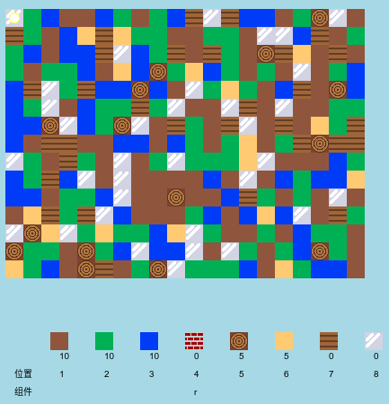

## 介绍

在这个项目中，您将设计和编码Minecraft的2D版本的改进。

  <iframe src="https://trinket.io/embed/python/ebc5b0148b?outputOnly=true&start=result" width="600" height="500" frameborder="0" marginwidth="0" marginheight="0" allowfullscreen>
  </iframe>
  

### 俱乐部导师的附加信息

如果您需要打印本项目文件，请使用[合适的打印版本](https://projects.raspberrypi.org/en/projects/codecraft/print)

## \--- collapse \---

## title: 俱乐部导师说明

## 介绍

在这个项目中，孩子们将通过改进基本的2D Minecraft副本来学习图形和游戏设计方面的知识。 孩子们将创造新的资源，并制定规则以结合资源以创造新的资源。 这将通过理解和操纵变量，列表和字典来实现。

## 在线资源

**本项目使用Python 3。**我们建议使用[ trinket](https://trinket.io/)在线编写Python代码。 这个项目包含如下Trinket代码:

+ ['CodeCraft'入门项目-rpf.io/codecraft-on](http://rpf.io/codecraft-on)

还有一个包括已完成项目的Trinket：

+ ['CodeCraft'完成-trinket.io/python/ebc5b0148b](https://trinket.io/python/ebc5b0148b)

## 离线资源

如果你愿意，本项目可以[离线完成](https://www.codeclubprojects.org/en-GB/resources/python-working-offline/)。 你可以点击本项目的“项目资料”链接访问项目资源。 这个链接包含一个 “项目资源” 部分，里面有孩子们完成该项目所需的离线资源。 请确保每个孩子都能获得这些资源。 这部分包含如下文件：

+ codecraft/codecraft.py
+ codecraft/variables.py
+ codecraft/brick.gif
+ codecraft/dirt.gif
+ codecraft/glass.gif
+ codecraft/grass.gif
+ codecraft/plank.gif
+ codecraft/player.gif
+ codecraft/sand.gif
+ codecraft/water.gif
+ codecraft/wood.gif

你也可以在 “志愿者资源'”部分找到该项目的完成版本，里面包含：

+ codecraft-finished/codecraft.py
+ codecraft-finished/variables.py
+ codecraft-finished/brick.gif
+ codecraft-finished/dirt.gif
+ codecraft-finished/glass.gif
+ codecraft-finished/grass.gif
+ codecraft-finished/plank.gif
+ codecraft-finished/player.gif
+ codecraft-finished/sand.gif
+ codecraft-finished/water.gif
+ codecraft-finished/wood.gif

(上述所有资源也可以以`.zip`压缩包的形式下载。)

## 学习目标

+ 创建和编辑图形；
+ 游戏设计;
+ 编辑： 
    + 变量
    + 列表;
    + 字典。

本项目涵盖[树莓派数字制作课程](http://rpf.io/curriculum)如下几方面内容：

+ [设计基本的2D和3D素材。](https://www.raspberrypi.org/curriculum/design/creator)

+ [综合利用编程结构解决问题。](https://www.raspberrypi.org/curriculum/programming/builder)

## 挑战

+ “打造您的世界”-玩游戏，放置和制作现有方块;
+ “更改世界大小”-编辑` MAPWIDTH `和` MAPHEIGHT `改变世界规模的变量；
+ “创建沙子”-创建新的沙子资源以及相关的游戏数据。
+ “用沙子制作玻璃”-创建新的可加工玻璃资源。
+ “创建更多资源”-使用已学到的知识来创建更多块和制定规则。

## 常见问题

+ 可能需要提醒孩子们字典或列表中的元素之间要用逗号分开。 例如，在向游戏添加库存物品，图形和手工规则时。

\--- /collapse \---

## \--- collapse \---

## title: 项目材料

## 项目资源

+ [包含所有项目资源的.zip文件](resources/codecraft-resources.zip)
+ [在线Trinket包含所有“CodeCrafe”项目资源](http://rpf.io/codecraft-on)

## 俱乐部导师资源

+ [包含所有完整版项目资源的.zip压缩包](solutions/codecraft-solution.zip)
+ [在线完整版Trinket项目](https://trinket.io/python/ebc5b0148b)

\--- /collapse \---