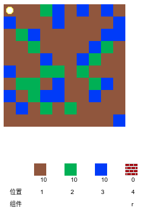
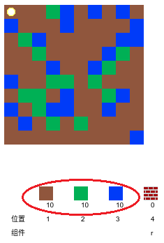
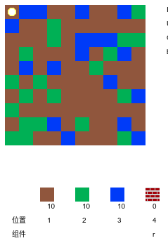
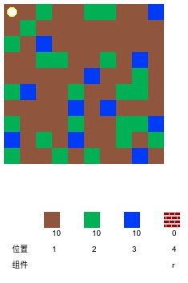

## 玩游戏

+ 打开这个示例 trinket： [rpf.io/codecraft-on](http://rpf.io/codecraft-on){:target="_blank"}.

+ 使用 WASD 键将您的玩家角色移动到世界各地，那里充满了各种资源 (泥土，草和水)。
    
    

+ 您可以按空格键来收集资源。 每资源都收集几个，您会看到它们已添加到物品栏中。
    
    

+ 按数字键 (1至3) 将资源放置在地图上。 例如，按 3 在地图上放一些水。 仅在物品栏中有水的情况下才起作用。
    
    

+ 您可以通过按菜单中显示的键来制作物品。 制造意味着将已经在你的物品栏中的物品组合来创建新的物品。 尝试按 “ r” 键来制作新砖块 (只要物品栏中有 2 个泥土和 1 个水)。
    
    

+ 然后，您可以按它们的“ 4”键放置您制作的砖块。
    
    