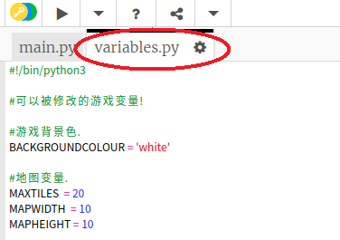
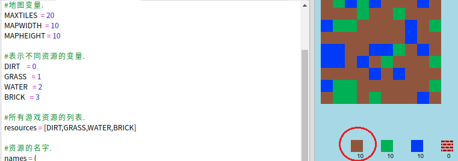

## 定制游戏

让我们修改一些变量以更改游戏的工作方式。

+ 点击 `variables.py` 文件以查看一些可以更改的变量。
    
    

+ 更改您的 `BACKGROUNDCOLOUR的值` 变量，然后单击“运行”以查看游戏更改。
    
    

+ 变量 `MAXTILES` 是物品栏中可以保留的每种资源的数量。 如果要存储的每个资源多于（或少于）20，请更改此变量。
    
    