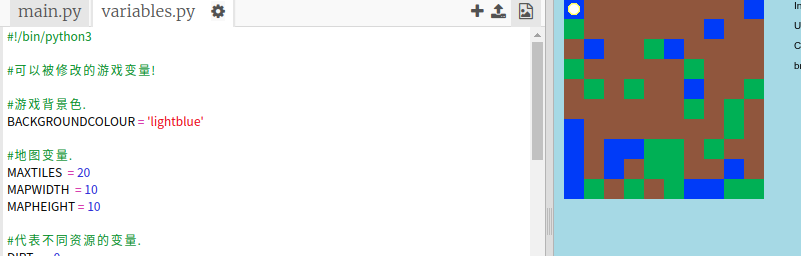

## 自定义你的游戏

让我们修改一些变量来更改你的游戏的运行方式。

+ 点击 `variables.py` 文件来查看可进行更改的一些变量。

    

+ 更改 `BACKGROUNDCOLOUR`（背景颜色）变量的值，然后点击“Run”（运行）来查看对游戏的更改。

    

+ `MAXTILES`（最大块数）变量指你的库存中可持有的每种资源的数量。如果你想储存 20 个以上（或以下）的各种资源，需更改此变量。

    

