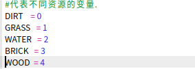
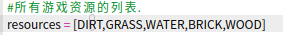
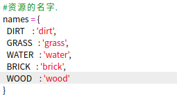
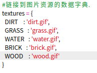
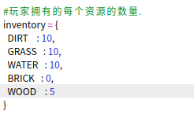
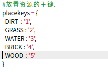
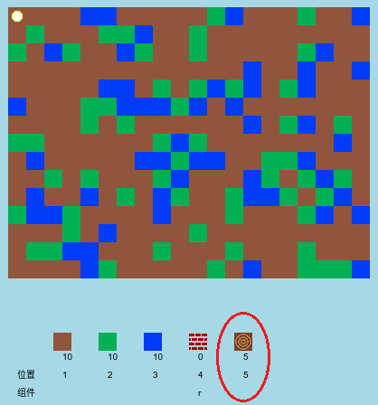
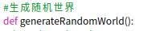
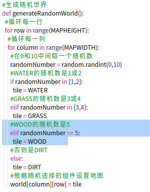

## 创建一个新的木材资源

让我们创建一个新的木材资源。 为此，您需要在 `variables.py` 文件中添加一些变量。

+ 首先，您需要给新资源一个编号。 然后，您将可以在您的代码中使用单词 `WOOD` 而不是数字 4。
    
    

+ 您应该添加新的 `WOOD` 资源到您的 `资源列表中` 。
    
    

+ 您还应该给资源指定一个名称，该名称将显示在清单中。
    
    
    
    注意逗号 `,` 在上面一行的末尾。

+ 您的资源还将需要一张图片。 该项目已经包含名为 `wood.gif `的图像 ，应将其添加到`textures` 字典。
    
    

+ 首先添加应该在你的 `物品栏` 中的资源的编号。
    
    

+ 最后，添加用于放置木头的按键。
    
    

+ 运行你的代码进行测试。 您会看到清单中现在有了新的“木材”资源。
    
    

+ 您的世界没有木头！ 要解决此问题，请单击您的 ` main.py ` 文件并找到名为`generateRandomWorld()` 的函数。
    
    
    
    此代码生成一个介于 0 到 10 之间的随机数，并使用该数字来决定放置哪个资源：
    
    + 1 或 2 = 水
    + 3 或 4 = 草
    + 其他数字 = 泥土

+ 添加此代码，当 `随机数字` 是 5 时，添加木头到你的世界。
    
    

+ 再次测试你的程序。 这次，您应该看到世界上出现了一些木头。
    
    