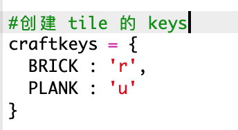

## 利用木材制作木板

让我们创建一个由木材制成的木板新资源。

+ 首先，添加一个新的游戏变量 `PLANK`。
    
    

+ 添加一个新的游戏变量 `PLANK`。
    
    

+ 将资源命名为 `'plank' `。
    
    

+ 给你的 `PLANK` 添加图像。 该项目已包含 `plank.gif`图片，但您可以根据需要创建和上传自己的图片。
    
    

+ 将木板添加到您的库存。
    
    

+ 设置用于放置木板的按键。
    
    

+ 由于这个资源可以被制作出来，因此需要创建一个制作规则，我们规定用 3 个木头可以制作出 1 块木板。 将此代码添加到 `crafting` 字典中。
    
    

+ 最后，您需要设置制作新木板的按键。
    
    

+ 要测试您的新木板资源，请收集一些木头资源，然后用木头制作一些木板。 然后，您可以将新木板放置在您的世界中。
    
    