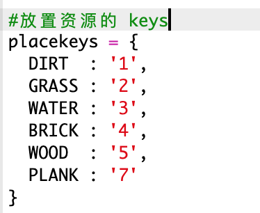

## 利用木材制作木板

让我们创建一个由木材制成的新木板资源。

+ 首先，添加一个新的` PLANK `您的游戏变量。
    
    

+ 首先，添加一个新的` PLANK `您的游戏变量。
    
    

+ 将资源命名为`'plank' ` 。
    
    

+ 给你的`木板`获取图像。 该项目已包含` plank.gif `图片，但您可以根据需要创建和上传自己的图片。
    
    

+ 将木板添加到您的库存。
    
    

+ 设置用于放置木板的主键。
    
    

+ 由于可以制作此资源，因此需要创建一个制作规则，即可以用3个木砖制作一块木板。 将此代码添加到`crafting`字典中。
    
    

+ 最后，您需要设置制作新木板的主键。
    
    

+ 要测试您的新木板资源，请收集一些木砖，然后用木头制作一些木板。 然后，您可以将新木板放置在您的世界中。
    
    