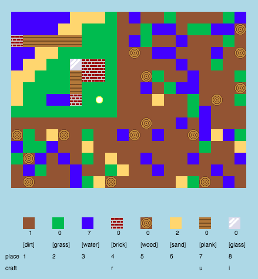

## 介紹

在這個專案中，您將會設計以及編寫程式來改善"當個創世神"的2D版本。

  <iframe src="https://trinket.io/embed/python/ebc5b0148b?outputOnly=true&start=result" width="600" height="500" frameborder="0" marginwidth="0" marginheight="0" allowfullscreen>
  </iframe>
  

### 給教師的其他資訊

如果您需要列印此專案，請使用 [列印友好模式](https://projects.raspberrypi.org/en/projects/codecraft/print)。

## \--- collapse \---

## 標題；給教師的資訊

## 介紹：

在這個專案中，學生們將通過改善簡單的2D"當個創世神"模組來學習圖形和遊戲設計的各種觀念。 學生們將創造新的資源, 並且對於新的混合資源制定規則 這可以通過理解和操作變數，列表和詞典來達成。

## 線上資源

**這個項目使用Python 3.** 我們建議使用 [trinket](https://trinket.io/) 線上編寫Python。 這項專案包含以下Trinkets：

+ ['CodeCraft'入門項目-- rpf.io/codecraft-on](http://rpf.io/codecraft-on)

還有一個內含挑戰解法的 trinket：

+ ['CodeCraft'完成 -- trinket.io/python/ebc5b0148b](https://trinket.io/python/ebc5b0148b)

## 離線資源

該專案可 [離線完成](https://www.codeclubprojects.org/en-GB/resources/python-working-offline/) ，如果您偏好離線作業。 你可以從「專案材料」連結取得專案相關資源。 這個連結含有'專案資源章節'，其中說明了學生離線完成專案所需要的資源。 請確認每個學生都有拿到這些資源的複本。 本節包括以下檔案：

+ codecraft / codecraft.py
+ codecraft / variables.py
+ codecraft / brick.gif
+ codecraft / dirt.gif
+ codecraft / glass.gif
+ codecraft / grass.gif
+ codecraft / plank.gif
+ codecraft / player.gif
+ codecraft / sand.gif
+ codecraft / water.gif
+ codecraft / wood.gif

你還可以在「志工資源」章節中找到專案完整版，其中包括以下檔案：

+ codecraft-finished/codecraft.py
+ codecraft-finished/variables.py
+ codecraft-finished/brick.gif
+ codecraft-finished/dirt.gif
+ codecraft-finished/glass.gif
+ codecraft-finished/grass.gif
+ codecraft-finished/plank.gif
+ codecraft-finished/player.gif
+ codecraft-finished/sand.gif
+ codecraft-finished/water.gif
+ codecraft-finished/wood.gif

(以上所有資源也都可以下載成`.zip下載`檔案)

## 學習目標

+ 創建和編輯圖形;
+ 遊戲設計;
+ 編輯： 
    + 變數;
    + 列表;
    + 字典。

本專案涵蓋 [樹莓派數位化課程](http://rpf.io/curriculum)以下內容：

+ [設計基本的2D和3D元件。](https://www.raspberrypi.org/curriculum/design/creator)

+ [結合編程結構來解決問題。](https://www.raspberrypi.org/curriculum/programming/builder)

## 挑戰

+ “建立你的世界” - 玩遊戲，放置和製作現有的街區;
+ “改變你的世界大小” - 編輯 `MAPWIDTH` 和 `MAPHEIGHT` 變數來改變世界大小;
+ “創建沙子” - 創建新的沙子資源以及相關的遊戲數據。
+ “用沙子製作玻璃” - 創造一種新的可製作的玻璃資源。
+ “創建更多資源” - 使用已學習的內容創建更多麥塊和製定規則。

## 常見問題

+ 可能需要提醒學生, 字典/列表的元素需要用逗號來分隔。 例如，在遊戲中添加庫存物品，圖形和製作規則時。

\---- /collapse \---

## \--- collapse \---

## 標題：專案材料

## 專案資源

+ [包含所有專案資源的.zip文件](resources/codecraft-resources.zip)
+ [線上Trinket包含所有'CodeCraft'專案資源](http://rpf.io/codecraft-on)

## 教師資源

+ [包含所有專案資源的.zip文件](solutions/codecraft-solution.zip)
+ [已完成的線上Trinket專案](https://trinket.io/python/ebc5b0148b)

\--- /collapse \---