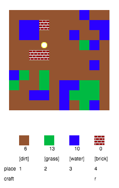

## 玩遊戲

+ 點擊這個Trinket連結:[rpf.io/codecraft-on](http://rpf.io/codecraft-on){:target="_blank"}。

+ 使用鍵盤上的WASD鍵將小白點移動到世界上的任一個地方，這世界充滿了不同的資源(土，草和水)。
    
    

+ 您可以按下空白鍵來收集資源。 每種類型的資源都撿起一些，您會看到它們已被添加到您的儲存庫中。
    
    

+ 按數字鍵(1到3) 將資源放在地圖上。 例如，按數字鍵3在地圖上放置一些水。 這僅適用於您的儲存庫中有水的情況。
    
    

+ 你可以通過按資源列表中顯示的按鍵來製作物品。 製作意味著你組合儲存庫中的資源以創建新物品。 嘗試按下“r”鍵來製作新磚塊(只要您的儲存庫中有2個土和1個水)。
    
    

+ 然後，您可以按下數字鍵'4'來放置您製作的磚塊。
    
    